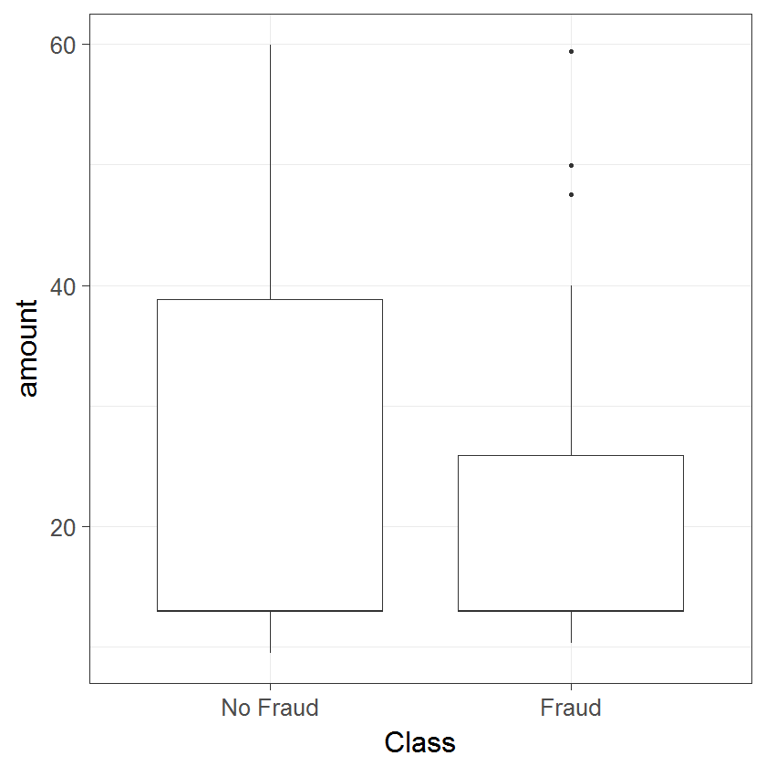

```{r setup, include=FALSE}
knitr::opts_chunk$set(echo = FALSE)
knitr::opts_chunk$set(message = FALSE)
```

# Variable Description

$N$ - number of observations

${\{(x_1,y_1),(x_2,y_2),...,(x_N,y_N)\}}$ - binary classification dataset, N pairs of features and dependent variables

$X$ - vector of features, with dimensions $N\times p$

$y_i \in \{-1,1\}$ - scope of values which the dependent variable can take

$Y$ - vector of dependent variables (or classes), with dimensions $N\times1$

$\beta$ - coefficient produced by fitting logistic regression

$w$ - weight vector normal to the hyperplane in SVM algorithm. 

$\Phi$ - nonlinear mapping function

$b$ - constant for the SVM algorithm

$\xi$ - slack variable in SVM algorithm

$C$ - misclassification cost in SVM algorithm

$K(x_i,x_j)$ - kernel functions

$\gamma$ - paramater in radial kernel function

$B$ - number of bootstrapped datasets in Random Forest algorithm

$Z^*$ - bootstrapped data sample

$T_b$ - tree grown on bootstrapped data sample

$s$ - randomly chosen subset of features

$\Psi(y_i,\rho)$ - loss function

$\rho$ - terminal nodes

$\lambda$ - regularization parameter

$F$ - number of nodes in neural network hidden layer

$g$ - number of classes

# 1.Introduction

What we provide here is an extensive study of machine learning methods on different both real-world and simulated datasets in an attempt to provide better guidelines for fraud detection. 

- specify the methods that are going to be used in the study

# 2. Financial Fraud

## 2.1. What is Financial Fraud and e-commerce?

The definition for fraud, as given by The Institute of Internal Auditors’ International Professional Practices Framework (IPPF), states:

“… any illegal act characterized by deceit, concealment, or violation of trust. These acts are not dependent upon the threat of violence or physical force. Frauds are perpetrated by parties and organizations to obtain money, property, or services; to avoid payment or loss of services; or to secure personal or business advantage.”

Financial Fraud as a whole can be divided into two major categories - Customer Fraud and Management Fraud [@bhardwaj2016financial]. In this paper, we will be focusing on Customer Fraud, or more precisely on Credit Card and Transaction Fraud. 

{width=70%}

Credit Card can also be categorized in two groups - application and behavioural fraud [@bolton2001unsupervised].The former category is essentialy the acquisition of new cards from the issuing companies using fraudulent or stolen information. The latter can be subcategorized into stolen or lost card, counterfeit card, "card not present" fraud and mail theft (See Figure 1). The stolen or lost card occurs when fraudster manages to obtain physical posession of the card. The next two fraud types, counterfeit and card not present, have been steadily rising in numbers, thanks to the emergence of online transactions [@fletcher2007challenges]. Lastly, mail theft fraud occurs when the credit card is intercepted before arriving by mail to the customer, or when fraudster steal personal information from bank and credit card statements [@capitaloneguide]. 

Broadly speaking, e-commerce represents the business transactions that are being made cyberspace, or "Digitally enabled transactions" [@laudon2013commerce]. There are five types of e-commerce - business-to-commerce (B2C), business-to-business (B2B), consumer-to-consumer (C2C), peer-to-peer (P2P) and mobile commerce (m-commerce). The most vulnerable to fraud are B2C and C2C, as the main reason is that in e-commerce the products and services can not be inspected before the transaction is done [@grabosky2001electronic]. Hence, we have increased risks of fraud. 

Thus, implementation of analytics that can scan through the transactions being made is necessary for minimizing losses [@buanuarescu2015detecting]. 

## 2.2. Costs of Financial Fraud

Financial Fraud is currently one of the biggest threats to business establishments, resulting in enormous finance losses each year. Only throughout the year 2015, the losses from credit card fraud amounted to $21.84 Billion [@nilson2016nilson]. Moreover, the losses occured by firms are not only monetary - damage on reputation and customer ties could prove to be devastating [@fraudanalyticsacl]. Thus, the overall losses from financial fraud are simply incalculable [@ngai2011application]. 

## 2.3. Combating Financial Fraud and Related Work

As a result from the increase in the amount of data globally, there has also been a rise in the use of predictive analytics [@buanuarescu2015detecting]. When talking about financial fraud, the forensic data analytics (FDA) are being used, but the percentage of sophisticated methods and software applied is not very high (See Table 1). A big percentage of the industry uses spreadsheet tools or database tools, which in their nature are primitive in terms of data analysis. 

```{r table analytics, echo = FALSE}
library(dplyr)
library(knitr)
library(kableExtra)
analytics_table <- data.frame ("Forensic Data" = c("Spreadsheet tools such as MS Excel",
                                                   "Database tools such as MS Access or MS SQL Server",
                                                   "Continious monitoring tools  (SAP, Oracle, SAI Global)",
                                                   "Text analytics tools or keyword searching",
                                                   "Forensic analytics software (ACL, iDEA)",
                                                   "Social media/web monitoring tools",
                                                   "Visualization and reporting tools (Tableau, Spotfire,                                                     QlikView)",
                                                   "Statistical analysis and data-mining packages (R,                                                        SAS, Stata, SPSS)",
                                                   "Big data technologies (Hadoop, Map Reduce)",
                                                   "Voice searching and analysis (Nexidia, NICE)"),
                               "Percent" = c("65%", "43%", " \n 29%", 
                                             "26%", "26%", "21%", 
                                             "12%", "11%", "2%", 
                                             "2%"))

kable(analytics_table, format = "pandoc", caption = "Forensic Data Analysis Tools in use") %>%
  add_footnote(c("Source [@analytics_tools_table]")) 
```

In the report by @analytics_tools_table, the respondents state that by using more complicated and proactive methods, they have faced a 59,7% reduction in median loss, in comparison to the respondents that did not. 

Among the more complex and successful methods for fraud reduction are machine learning (ML) techniques [@chaudhary2012credit]. The ML models used for FFD, and especially credit card fraud, can be broadly categorized into two major groups - supervised and unsupervised learning methods. The unsupervised techniques depend only on the characteristics of each transaction, grouping them into clusters with homogenous attributes. Whenever an observation is not assigned to an already existing cluster of legal transactions, it signals that there is a probability that the transaction is fraudulent [@bolton2001unsupervised]. However, most studies in the field have focused on the use of supervised learning methods for FFD [@ngai2011application]. In this framework, the model is trained on already labeled datasets, recognizing the patterns associated with fraudulent transactions. Among the techniques most used for credit card are logistic regression, support vector machines (SVM), artificial neural networks (ANN), bayesian networks, and different tree models [@ngai2011application; @bhattacharyya2011data; @chaudhary2012credit].

The focus on this paper will be on supervised learning methods. In the literature, a greater focus has been put on supervised methods [@ngai2011application], but the overall are of fraud detection has not been thoroughly explored, due to the sensitivity and public unavailaibility of datasets [@dal2015adaptive]. In the studies that have been done, the overall focus has been on ANNs. Among the first to adopt an ANN approach to the problem of FFD are @ghosh1994credit, through the use of a P-RCE ANN - a three layer and feed-forward network. The method employed had relative success, identifying correctly on average 40% of the fraud. The ANN is since then among the most used methods for FFD. @brause1999neural and @dorronsoro1997neural have achieved better results with an ensemble method including ANNs. However, ANNs have been, and still are, considered as black-box models and are hard to interpret. Thus, other methods, such as random forest, have risen in popularity and have also shown impressive performance in the field of FFD [@bhattacharyya2011data; @dal2014learned]. Logistic Regression is also quite popular, especially due to its strong interpretability, but can sometimes lack the prediction power of other, more complex ML algorithms [@bhattacharyya2011data]. The SVM has also been employed, due to its advantages in terms of solid theoretical foundations. However, the results produced by the methods have been mixed, mainly because the FFD problem poses an imbalanced class challenge [@chaudhary2012credit; @bhattacharyya2011data]. Nonetheless, it has been shown that through changes in the foundations of the SVM method, in order to transform to model into a cost-sensitive one, better performance can be achieved on problems with imbalanced data [@he2009learning].

Slightly surprising is that almost no research about the performance of boosting methods has been made in the field of FFD, especially credit card fraud, given the capabilities of ML models such as stochastic gradient boosting machines and eXtreme gradient boosting [@nielsen2016tree; @chen2016xgboost]. We will deploy both methods in order to compare their performances against the other, more established, frameworks.   

# 3. Methodology

Classification is one of the most widely used model framework used for the application of machine learning techniques in terms of FFD [@ngai2011application]. Some of the most common classification techniques include logistic regression, neural networks, support vector machine and decision trees and their variations.

## 3.1. Preliminaries

In the current section, we will give a description of the machine learning techniques that we apply to predict fraudulent transactions. 

Let us define our binary classification dataset as ${\{(x_1,y_1),(x_2,y_2),...,(x_N,y_N)\}}$, where $x_i\in \mathbb{R}^n$ represents an n-dimensional data point and $y_i \in \{-1,1\}$ represents the label of the class of that data point, $i = 1,...,p$. Let $X$ represent the vector of features and $Y$ the vector of dependent variables.   


## 3.2. Machine Learning Algorithms

### 3.2.1. Logistic Regression

The logistic regression framework falls under the category of generalized linear models and allows the prediction of discrete outcomes. Then, by defining the probability of a transaction being fraudulent by $p(X) = Pr(Y=1|X)$, we can portray the relationship between the dependent and independent variables as follows:

$$p(X) = \frac{e^{\beta_0 + \beta_1X_1 + ... + \beta_pX_p}}{1 + e^{\beta_0 + \beta_1X_1 + ... + \beta_pX_p}}\;\;\;\;(1)$$

The number of independent variables is indexed by *p*. After manipulating (1), we can also see that $$log(\frac{p(X)}{1-p(X)})=\beta_0+ \beta_1X_1 + ... + \beta_pX_p\;\;\;\;(2)$$ with the LHS being called the logit. Using equation (2), we will predict the probabilities of a transaction being fraudulent i.e. $p(Y = 1)$. The fitting of a logistic regression is done by the method of maximum likelihood (see Appendix). The logistic regression has been among the most widely used framework in fraud detection [@ngai2011application] due to simplicity of ease of implementation, but it does have its shortcomings - it tends to underperform when there are multiple or non-linear decision boundaries (_SEARCH FOR SOME PAPER OR BOOK ON IT?_)

### 3.2.2. Neural Networks

Neural Networks is a term that currently describes a wide array of different algorithms. However, we will be using the "vanilla" version, which contains only a single hidden layer, but this can be extended to include more [friedman2001elements]. However, that is beyond the scope of this paper. 

A feed-forward neural network with one hidden layer can be seen in Figure 1. It has $g$ outputs nodes, which in our case would be $g=2$, as we are dealing with two-class classification problem. Each output node would give us the probability of an observation belonging to a specific class. 

{width=60%}

The features $Z_f$ are being derived through linear combinations of the inputs, while the $Y_g$ outputs are then modeled as a function of linear combinations of the $Z_m$, or mathematically formulated as follows:

$$Z_f=\sigma(\alpha_{0f}+\alpha_{m}^{T}X),\;f=1,...,F$$
$$T_g=\beta_{0g}+\beta_{k}^{T}Z,\;g=1,2$$
$$f_{g}(X)=g_g(T),\;g=1,2$$

where $T=(T_1,T_2)$, $Z=(Z_1,Z_2,...,Z_F)$ and $g_g(T)=\frac{e^{T_g}}{\sum_{f=1}^{F}e^{T_f}}$ represents the softmax function. We use the sigmoid activation function $\sigma(v)=\frac{1}{1+e^{-v}}$. In order to fit the neural network and estimate the set of weights $\{\alpha_{0f},\alpha_{f};f=1,2,3...,F\}$ and $\{\beta_{0g},\beta_{g},g=1,2\}$, we use the backpropagation equations in order to minimize the error term.  

### 3.2.3. Support Vector Machines

Support Vector Machines, developed by Vapnik et. al. [@cortes1995support], have become a popular machine learning method that has seen its implementation rise in various domains that require the use of classification models [@batuwita2013class]. Among the factors for its success is the fact that the SVMs are linear classifiers, which work in a high-dimensional feature that represents a non-linear mapping of the input space of the problem being dealt with [@bhattacharyya2011data]. Working in a high-dimensional feature space has its benefits - often, the problem of non-linear classification in the original input space is transformed to a linear classification task in the high-dimensional feature space. 

The goal of the SVM classifier consists of finding the optimal separating hyperplane, which manages to effectively separate the observations from the data into two classes. As mentioned above, the observations are initially transformed by a nonlinear mapping function $\Phi$. Thus, we can write a possible separating hyperplane that resides in the transformed higher dimensional feature space by:

$$w\cdot\Phi(x)+b=0\;\;\;\;(3)$$
with $w$ the weight vector normal to the hyperplane. 

We will further use two variations of the SVM soft margin optimization problem - one that assigns the same cost for missclassification of the different classes and one that penalizes more the missclassification of the minority class.

#### Non-cost sensitive learning

For the same missclassification cost case, we can write the soft optimization problem as follows:
$$\min(\frac{1}{2}w \cdot w + C\sum_{i=1}^{p} \xi_i) $$ 
$$s.t. \;\; y_i(w \cdot \Phi(x_i) + b) \geq 1 - \xi_i\;\;\;\;(4) $$
$$\xi_i \geq 0, i = 1,...,p$$
The slack variables $\xi_i > 0$ hold for missclassified examples. Thus, the penalty term $\sum_{i=1}^{p}$ can be perceived as the total number of missclassified observations of the model. Thus from (4), we can see that there are two goals - maximizing the margin the minimizing the number of missclassifications. The cost parameter C controls the trade-off between them, i.e. assigned misclassification cost. The quadratic optimization problem in (4) can be represented by a dual Lagrange problem and then solved:
$$\max_{\alpha_i} \{ \sum_{i=1}^{p}{\alpha_i} - \frac{1}{2} \sum_{i=1}^{p}\sum_{j=1}^{p}{\alpha_i\alpha_j\Phi(x_i)\cdot\Phi(x_j)} \} \;\; s.t. \;\; \sum_{i=1}^{p}{y_i\alpha_i}=0, \;\; 0 \leq\alpha_i\leq C, \;\; i=1,...,p\;\;\;\;(5) $$

$\alpha_i$ are the Lagrange multipliers also satisfying the Karush-Kuhn-Tucker (KKT) conditions (see Appendix). Thanks to another one of the strenghts of SVM - kernel representation - we don't need to explicitly know the mapping function $\Phi(x)$, but by applying a kernel function (i.e. $K(x_i,x_j) = \Phi(x_i)\cdot \Phi(x_j)$), we can rewrite (5) as:
$$\max_{\alpha_i} \{ \sum_{i=1}^{p}{\alpha_i} - \frac{1}{2} \sum_{i=1}^{p}\sum_{j=1}^{p}{\alpha_i\alpha_jK(x_i,x_j)} \} \;\; s.t. \;\; \sum_{i=1}^{p}{y_i\alpha_i}=0, \;\; 0 \leq\alpha_i\leq C, \;\; i=1,...,p\;\;\;\;(6)$$
The solution then gives us $w = \sum_{i=1}^{p}{\alpha_iy_i}\phi(x_i)$ for the optimal values of $\alpha_i$ and $w$, while $b$ is determined from KKT. The data points that have $\alpha_i$ different than zero are called the support vectors. Thus, the decision function can be written was:
$$f(x) = sign(w \cdot \Phi(x) + b) = sign(\sum_{i=1}^{p}{\alpha_iy_i}K(x_i,x_j) + b)\;\;\;\;(7) $$

#### Cost Sensitive learning

The regular SVM model has been effectively implemented when the dataset used has balanced classes, however it fails to produce good results when applied on imbalanced data [@batuwita2013class]. When trained on a dataset with extremely imbalanced classes, the SVM framework could produce so skewed hyperplances that all observations are recognized as the majority class [@akbani2004applying, @veropoulos1999controlling]. This is due to the fact that when we take the soft margin optimization problem, we try to maximize the margin and minimize the penalty for the misclassifications. As we consider a constant C for all training examples, the minimization of the penalty is achieved through the minimization of all misclassifications. However, when the used dataset suffers from imbalanced classes, the majority class density would be higher than the minority class density, even when considering the class boundary region (through which the ideal hyperplane would pass). 

Thus, we consider here the application of the Different Error Costs (DEC) variation of the SVM algorithm proposed by @veropoulos1999controlling. The DEC method introduces different misclassification costs - $C^+$ for the minority and $C^-$ for the majority class. With the inclusion of the higher misclassification cost for the minority class observations, the imbalanced class effect could be brought down. The soft margin optimization problem then has the following form:
$$\min{(\frac{1}{2}w \cdot w + C^+\sum_{i|y_i=+1}^{p}\xi_i + C^-\sum_{i|y_i=-1}^{p}\xi_i)}$$
$$s.t. \;\; y_i(w \cdot \Phi(x_i) + b) \geq 1 - \xi_i\;\;\;\;(8)$$
$$\xi_i \geq 0, i = 1,...,p$$
The Dual Lagrange optimization form is the same as before, with the exception of replacing $0 \leq\alpha_i\leq C$ with $0 \leq\alpha_i^+\leq C^+, \; 0 \leq\alpha_i^-\leq C^-$ for $i=1,...,p$. The $\alpha_i^+$ and $\alpha_i^-$ are the Lagrange multipliers. The solution of the DEC dual Lagrangian problem follows the same outline as in the normal form. 

#### Kernels

As mentioned before, we used a kernel function ($K(x_i,x_j) = \Phi(x_i)\cdot \Phi(x_j)$) in order to transform the dual Lagrange problem. The advantages of using kernel functions are computational or in some cases it allows for computations that otherwise would be impossible (@james2013introduction). For the purpose of this study, we are using the linear and radial kernels. The radial kernel shows good performance on non-linear class separation. They have the following representations:
$$Linear: \;\;\; K(x_i,x_j) = \sum_{k=1}^{l}x_{ik}x_{jk}\;\;\;\;(9)$$
$$Radial: \;\;\; K(x_i,x_j) = exp(-\gamma\sum_{k=1}^{l}(x_{ik}-x_{jk})^2), \;\; \gamma=\frac{1}{2\sigma^2}\;\;\;\;(10)$$

### 3.2.4. Tree-Based Methods

Tree-based methods involve segmentation of the feature space into a set of regions and then fitting a simple model to each one. Even though are not too complex conceptually, they are still a very powerful method [@friedman2001elements]. Firstly, we will give a short overview of a standard classification decision tree (DT) before moving on the methods used in this study. 

Let us call the set of non-overlapping regions $R_1,R_2,...,R_M$ that are used to divide the feature space. The forms of those regions are high-dimensional rectangles - for simplicity and interpretability. The aim for DT would be to find the boxes that minimize the error term, which in the case of classification can be represented in several ways - misclassification error, Gini index or cross-entropy. However, it is very computationally taxing to consider every feasible partition of the feature space into $M$ boxes. Thus, the recursive binary splitting method is used, which is a top-down, greedy approach - it starts at the top of the tree and then it splits the feature space, making the best split possible, without looking forward. The algorithm is further described in the Appendix. 

However, the beforementioned algorithm can sometimes lead to over-fitting and producing very ineffecient prediction results. Thus, the tree pruning technique is applied - first a large tree is grown, then it is "pruned" and a smaller version is obtain. The procedure leads to reduction in variance at the cost of some bias. Usually the cost complexity pruning algorithm is used in practice - a more thorough description is included in the Appendix. 

The regular classification DT has high interpretability, but it sometimes lacks sufficient prediction power - they are often unstable and can be too sensitive to training data [@bhattacharyya2011data]. This leads us to variations of the classic classification DT. 

#### Random Forests

A random forest algorithm is an ensemble of classification trees [@breiman2001random]. The model starts with growing each tree on separate bootstrapped dataset. Moreover, only a randomly selected feature subset, typically $s \simeq \sqrt{p}$ [@khoshgoftaar2007empirical], is used at each individual node. As a result, the entire algorithm is based on two basic, yet powerful, concepts - bagging and random subspace method. To better illustrate the random forest method, the pseudo-algorithm is given below:


_Algorithm Random Forest_

1. For $b$ = 1 to $B$ ($B$ is representing the number of bootstrapped datasets):
    + Draw bootstrapped sample $Z^*$ of size $N$ from the dataset used for training 
    + Grow a RF tree $T_b$ on the previously bootstrapped dataset by recursively looping the below given steps for each tree terminal node, up until the $n_{min}$ node (minimum size node) is reached:
        - Select $s$ features randomly from the entire feature subset, $p$. 
        - Choose the best available variable/split-point among the $s$.
        - Split node into two children nodes.

2. Output the tree ensemble $\{T_b\}^{B}_{1}$.
3. Making the prediction for a new point $x$:
    If $\widehat{C}_b(x)$ is the prediction of the class for the $b$th RF tree, then $\widehat{C}_{rf}^{B}(x)=majority\;vote\{\widehat{C}_b(x)\}_{1}^{B}$.

The Random Forest algorith has been quite popular lately, due to its simplicity and performance. It has only two parameters that can be changed - the number of trees grown and the size of the feature subset used [@breiman2001random]. Furthermore, it has often shown superior performance to one if its rival statistic learning method - the SVM [@meyer2003support]. In the area of financial fraud detection, RF has also shown to be a promising framework [@whitrow2009transaction, @ngai2011application].

#### Stochastic Gradient Boosting Machines and eXtreme Gradient Boosting Machines

The ideas introduced by the boosting methodology have been among the most influential in the last twenty years [@friedman2001elements]. Among the most used and influential boosting algorithms is "AdaBoost.M1" [@freund1997decision]. It was the first developed "adaptive" boosting algorithm, due to its incorporated function to directly adjust its parameters to the used training dataset. This is due to the fact, that the performance of the model was re-evaluated at each iteration - the parameters weights and the final aggregated weights, were re-calculated and improved at each iteration, thus leading to an overall better performance. Moreover, it was found that not only AdaBoost, but boosting algorithms in general, managed to not only reduce variance, but also bias - an improvement over bagging, where only the variance could be decreased. 

The followwing success led to the formulation and development of the gradient-descent based methods, which received the name gradient boosting machines or simply GBM [@freund1997decision; @friedman2000additive; @friedman2001greedy]. The general idea of GBMs is to fit new models iteratively, constructing the base-learners to be maximally correlated with the loss function's negative gradient, in order to get a better estimate of the response variable [@natekin2013gradient]. Moreover, the algorithm offers flexibility in terms of choosing the form of the loss function. In this study, we use the Bernoulli distribution, as we are dealing with a two-class classification problem. 

Due to its flexibility and ease of implementation, the GBM algorithm has proven to be a successful model, that offers high predictive power when dealing with machine learning problems [@whiting2012machine, @johnson2014learning]. Furthermore, when including a random element in the algorithm, as in the Stochastic GBM (SGBM), results tend to improve [@friedman2002stochastic]. We describe the pseudo-code of the SGBM for a two-class problem below.

_Stochastic Gradient Tree Boosting Machines (Stochastic GBM)_

Two-Class Classification as in the **gbm** R package.

1. Initialize $f_{0}(x) = \arg\min_{\rho}\sum_{i=1}^{N}\Psi(y_i,\rho)$.

2. For $m=1$ to $M$ do:
    + Compute negative gradient:
  $$z_{im}=-\frac{\partial{\Psi(y_{i},f(\mathbf{x}_i))}}{\partial{f(\mathbf{x}_i)}}\rvert_{f(\mathbf{x}_i)=\widehat{f}(\mathbf{x}_i)},\; i=1,...,N$$
    + Randomly select $s \times N$ subset.
    + Fit regression tree with K number of terminal nodes on the previously selected subset, $g(\mathbf{x})=E(z|\mathbf{x})$.
    + Compute the optimal terminal node predictions, $\rho_{1m},...,\rho_{Km}$, as:
    $$\rho_{km}=\arg\min_{\rho}\sum_{\mathbf{x}_i \in S_k} \Psi(y_i,\widehat{f}(\mathbf{x}_{i})+\rho_k)$$,
    where $S_k$ is the set of $\mathbf{x}$'s that define terminal node $k$.
    + Compute $\widehat{f}_{m}(x)=\sum_{k=1}^{K}\rho_{km}I(x_i\in\widehat{R}_{km})$, as $\{\widehat{R}_{km}\}_{k=1}^{K}$ represents the tree structure.
    + Update $\widehat{f}^{m}(\mathbf{x})$ as $\widehat{f}^{m}(\mathbf{x}) \leftarrow \widehat{f}_{m-1}(\mathbf{x}) + \lambda\widehat{f}_{m}(x)$.  
      

3. Output $\widehat{f}(x) = f_{M}(x)$

The eXtreme Gradient Boosting algorithm, or shortly XGBoost, was developed as an attempt to improve on the performance of GBM, both in terms of speed and prediction power [@chen2016xgboost]. It has has not only succeeded in doing so, but it has also become one of the most used models [@nielsen2016tree]. Among the differences that XGBoost introduces in comparison to the GBM model is that the former uses clever penalization of the individual trees - the leaf weights are not all decreased at the same rate, instead the weights which are estimated without much evidence from the training set will be shrunk more heavily relative to others. Furthermore, the XGBoost employs another type of boosting structure when compared to GBM - Newton boosting. Due to this, the algorithm manages to better learn tree structures, leading to learning better neighbourhoods. XGBoost also incorporates a randomization paramater, which contributes to the individual tree decorellation and reducing variance. Some technical detail references regarding the differences between XGBoost and GBM are included in Appendix 9.1 - such as the gradient and Newton boosting and leaf weight learning. The general pseudo-codes are similar. 


## 3.3. Cross-Validation

The framework for model training that we use in this study is a $k$-fold Cross-Validation (CV) with $k=10$ [@james2013introduction]. The method incorporates a random division of the training set into $k$ folds with approximately similar size. The initial fold is used a validation set and the chosen statistical learning model is fit on the remaining $k-1$ folds. The error is then calculated on the observations in the held-out fold. The entire process is then repeated $k$ times, with a different validation set at each iteration, thus computing $k$ estimates of the test error. The $k$-fold CV estimate can then be shown as:
$$CV_{(k)}=\frac{1}{k}\sum_{i=1}^{k}Err_i$$ 
where $Err_i = I(y_i\neq \widehat{y}_i)$. 

There are other approaches to CV, such as the Leave-One-Out CV (LOOCV), but the $k$-fold CV has shown to be superior in both computational time and estimate accuracy [@friedman2001elements]. The latter is connected to the bias-variance trade-off problem, but a discussion is out of the scope of this paper. A graphical representation can be seen in Figure 1 in Appendix Section 9.4. 

# 4. Data

## 4.1. Datasets

The number of datasets that we will be using in this study is four - two real-world and two simulated. Each dataset has been randomly splitted to two - a train and a test subset. The train consists of 60% of the original dataset, while the test the remaining 40%. 

### 4.1.1. Real-World Datasets

#### UCSD-FICO Data Mining Contest 2009

The dataset was released by FICO, one of the leading analytics providers, and the University of California, San Diego (UCSD). It consists of real-world e-commerce transactions and it was released in two versions - an "easy" and a "hard" one. We will be using the "hard" version for the assessments of the models used. Due to the fact, that is a real-world data set, anonymiziation is introduced, which means that methods depending on feature aggregation or feature engineering will not lead to improvement in efficiency [@seeja2014fraudminer]. Nonetheless, some data preprocessing is done. 

The dataset consists of 100 000 transactions made by 73 729 different customers throughout 98 days. Each transaction is characterized by 20 features - amount, hour1, state1, zip1, custAttr1, field1, custAttr2, field2, hour2, flag1, total, field3, field4, indicator1, indicator2, flag2, flag3, flag4, flag5. It can be observed that custAttr1 is the customer card number, while the custAttr2 is the e-mail address. As both fields are unique, we discard custAttr2. The other unique feature pairs per customer are the amount/total, hour1/hour2 and state1/zip1, thus discarding total, hour2 and state1 leaves us with 16 fields. 

Furthermore, customers with just one transaction have been removed, leaving us with 40 918 transactions. Only 2.922% of the transactions are fraudulent, which indicates severe imbalacedness. 

#### Université Libre de Bruxelles (ULB) Machine Learning Group

The dataset was released by the Université Libre de Bruxelles (ULB) Machine Learning Group and it consists of real-world credit card transactions made throughout two days from the year 2013 [@dal2015calibrating]. Strong anonymization is introduced, as the entire dataset has gone through a Principal Component Analysis (PCA) transformation. 

The number of transactions included are 284 807 with 30 features characterizing each one. The only two labeled features are Time and Amount, while all 28 others are numericals resulting from the PCA. We do not do any feature engineering, as there is no information on what each column represents.

The number of frauds is just 492, which means only 0.172% of all transactions are positively labeled, indicatin very severe class imbalance. 

### 4.1.2. Simulated Datasets

Due to lack of publicly available datasets on real-world fraud, the simulation of such has become important [@lopez2014social]. Thus, we will use two generated sets in order to evaluate the chosen statistical learning methods and gather more data on their performance in the area. 

#### PaySim

The first synthetic dataset that we will use originates from a simulator called PaySim, which was developed by @lopez2014social. It represents a simulation based on an e-commerce payment platform for making payments through a mobile device. 

The generated dataset is constructed thanks to an agent-based-simulation application, which uses real-world information. It consists of nine features - step, type, amount, nameOrig, oldbalanceOrg, newbalanceOrig, nameDest, oldbalanceDest and newbalanceDest. The step represents a time-stamp, the type shows what kind of transaction occurs, nameOrig and nameDest give us unique ID's of the sender and receiver of the transaction, while the rest oldbalanceOrg, newbalanceOrig, oldbalanceDest and newbalanceDest represent the amount present in the accounts of the sender and receiver before and after the financial transaction has been made. Furthermore, we introduce some feature engineering by creating two more variables - errorBalanceOrig and errorBalanceDest. The errorBalanceOrig is generated by summing up newbalanceOrig and amount and then subtracting oldbalanceOrg. The motivation behind this is that a positive errorBalanceOrig could be a fraud pattern, due to an amount of being lost along the line of the transaction.

Overall, the dataset consists of 6 362 620 observations, but only 0.129% of them are fraudulent, indicating very severe classimbalance. Due to the large size of the dataset and the computationally-demanding methodology that we are using, only a 100 000 observation subset will be used.  

#### BankSim

The second synthetic dataset that we will be working on was generated by a simulator called BankSim, developed by @lopez2014banksim. It is a simulation application based on aggregated transactional data provided by a bank entity in Spain. 

The datasets consists of nine features - step, customer, age, gender, zipcodeOri, merchang, zipMerchant, category and amount. The step represents a time stamt, customer and merchant give us the unique IDs of the sender and receiver of the transaction, zipcodeOri and zipMerchant indicate from where the payment originates and where it is received, the age feature consists of different age brackets, category tells us what is the purpose of the transactions made and gender and age are self-explanatory. 

The dataset consists of 594 643 observations, but only 1.21% of them are marked as fraudulent, indicating severe class imbalance. 

## 4.2. Problems of Imbalanced Data and Data Sampling Techniques

### 4.2.1. Problem of Imbalanced Data

One of the biggest challenges faced in detecting fraudulent transactions is the one of unbalanced class sizes, with legitimate class outnumbering vastly the fraudulent one [@bhattacharyya2011data]. The application of data-sampling techniques has been widely used in the literature with various results when combined with different algorithms, as when such a problem occurs, it could hinder the model performances [@van2007experimental]. Moreover, in our particular case, the cost of missclassifying the minority class could prove to be a lot more costly than predicting wrongly the majority one. 

### 4.2.2. Data Sampling Techniques

#### Random Oversampling (ROS)and Random UnderSampling (RUS)

The two techniques are the simplest and most common [@van2007experimental]. In minority oversampling (ROS), the observations from the minority group are randomly duplicated in order to balance the dataset. In majority undersampling (RUS), the aim is the same, but it is achieved by randomly removing observations of the majority class. 

#### SMOTE

The Synthetic Minority Oversampling Technique (SMOTE), proposed by Chawla et al. [@chawla2002smote], artificial minority instances are created not simply through duplication, but rather with the extrapolation between preexisting observations. The technique starts by taking into account the k nearest neighbourhoods to a minority observation for every instance from that class. Then, the artificial observation are created, taking into account just a part of the nearest neighbours or all of them (with respect to the desired oversampling specification). 

# 5. Results

## 5.1. Performance Measures

As the problem that we deal with in this paper is a classification one, the performance measures used to evaluate how successful a model will be related to the main building block of binary classification - the confusion matrix.

```{r conf_matr_basis, echo = FALSE}
library(dplyr)
library(knitr)
library(kableExtra)
conf_matrix <- data.frame("." = c("Predicted Positive", "Predicted Negative"),
                          "Actual Positive" = c("True Positive (TP)", "False Negative (FN)"),
                          "Actual Negative" = c("False Positive (FP)", "True Negative (TN)"))

kable(conf_matrix, format = "pandoc") 
```

### 5.1.1. Threshold Metrics

$$Sensitivity = \frac{TP}{TP + FN}\;\;\;\;\;\;Specificity =\frac{TN}{FP+TN} $$
The sensitivity of a given classifier indicates what percent of the positive class has been actually predicted as positive. Analogically, specifity gives the percent of the negative class which has been assigned as negative by the model. Overall, the measures give us a picture of the proportions that have been correctly predicted.

$$Precision = \frac{TP}{TP+FP}\;\;\;\;\;\;Recall=\frac{TP}{TP+FN}$$
The precision measure indicates how well the used classifier identifies a given class' observation, i.e. checks the percent of the observations assigned a positive class that are truly positive. The recall formulation is same as the sensitivity one. Both measures are typically used together in order to get more information about the positive class. 

$$F_\alpha=\frac{(1+\alpha)[precision \times recall]}{[\alpha\times precision] + recall}$$
The F-measure falls to the category of combination metrics and its purpose is to combine the precision and recall in a single scalar. One of its advantages is that allows us to weight the two components as desired through the $\alpha$ component. Usual values of $\alpha$ are $0.5, 1$ or $2$ - with $1$ we specify that precision and recall are equal in weights, $2$ indicates precision is twice as important as recall and $0.5$ gives two times more weight to recall. When dealing with class imbalanace, the F-measure can give more in-depth insight [@japkowicz2013assessment].

### 5.1.2. Ranking Methods and Metrics

#### ROC Curve Analysis

The Receiver-Operating-Characteristic, or simply ROC, is a simple, yet very powerful tool. The ROC curve is created by using the False Posititve Rate (FPR) and Sensitivity (or True Positive Rate (TPR)) and plotting them against each at different threshold settings. The FPR is defined as $FPR=\frac{FP}{FP+TN}$. An example ROC curve can be seen in Figure 3. The better the line "hugs" the upper left corner of the ROC space, the better the trained classifier is. A model that produces a line that is close to the 45-degree separator means that it does not perfor better than random guessing. 

{width = 60%}

Moreover, when dealing with imbalanced classes, the ROC metric is a very suitable indicator of whether a model is a good fit. The first reason is that we have the performance of each class shown separately (through the two axes) and the second one is that it gives a good overview what can happen in different situations [@japkowicz2013assessment]. 

#### Precision and Recall Curve Analysis

The Precision and Recall (PR) Curve Analysis is very similar to ROC Curve Analysis, as it once again gives an overview of the correctly-classified positive class and and the number of incorrectly-classified negative observations. However, the PR curve plots, as expected, the precision and recall on the two axes, showing the various states the precision metric can take given different levels of recall. Unlike the ROC curve, the PR one has a negative slope, due to the fact precision decreases with the increase of recall. There have been suggestions that PR curves can be more informative than ROC curves when working with imbalanced classes [@davis2006relationship].

#### Area-Under-Curve (AUC)

The AUC metric illustrates the performance of a classification model averaged over all of the feasible cost ratios. Given that the ROC curve operates in a unit square, it can be seen that the AUC in this case could take values only between 0 and 1, i.e. $AUC \in [0,1]$, with $AUC=1$ representig the perfect classifier and $AUC=0.5$ the random one. It can be argued that the AUC is a good summary metric that can assess the performance of a classifier and be used for comparisons, but it too loses significant information over the entire operating range (for instance trade-off behaviour between TP and FP performances).  

## 5.2. Experimental Results

We have conducted all experiments on a machine running 4GB RAM, Intel(R) Core(TM) i3-2330M CPU @ 2.20GHz or on the Kaggle Cloud Computing Service, where depending on the statistical model that was geing calculated, up to 32 cores and 17 GB RAM were utilized. The programming software that we used was R - R Studio on the local machine and R scripts on the cloud. 

We will use 10-fold Cross-Validation in order to tune the model parameters and will use the ROC as an optimization criterion, as it is argued that it is a good indicator when dealing with imbalanced classes [@he2009learning]. The Accuracy metric will be used as little as possible to determine a classifier performance, as even if a model fails to classify a single observation from the minority class, the accuraccy will still be high (and close to 100% in some cases, due to sever class imbalance).  

### 5.2.1. UCSD

As mentioned in **Section 4.1.1.**, we wil work with 40 918 observations. As this is a real dataset and its features are mostly masked, this means that there is no real feature engineering that we can perform before applying any machine learning techniques. 

From the 40 918 observations, only 1 196 are fraudulent. Hence, there is not much that we derive from our raw data and that can be observed from the graphics created to illustrate the distribution of the different features. The only interesting note that can be taken is that it seems the fraudulent class is usually associated with a transaction that has a lower amount. This can be seen in the boxplot figure:

{width = 40%}


### 5.2.2. Credit Card

### 5.2.3. PaySim

### 5.2.4. BankSim

# 6. Further Improvements

# 7. Conclusion

# 8. References

