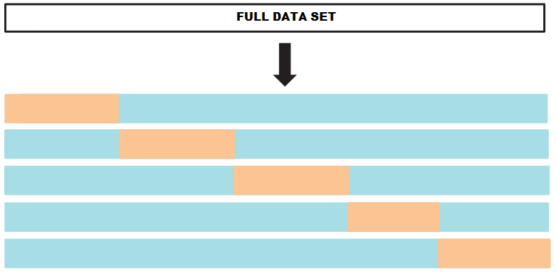
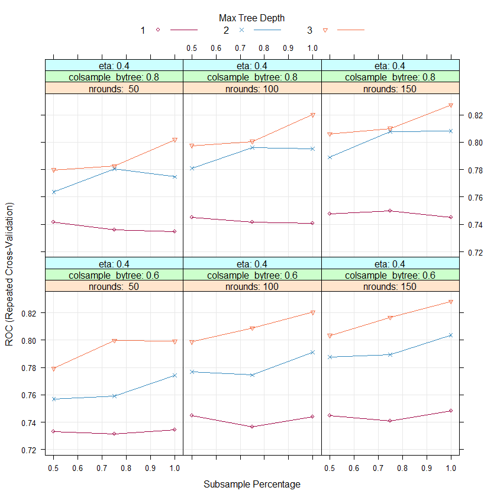

---
output:
  pdf_document:
    fig_caption: yes
    keep_tex: yes
    latex_engine: pdflatex
bibliography: references.bib
urlcolor: black
linkcolor: black
fontsize: 12pt
geometry: margin = 1.18in
header-includes:
- \usepackage{ragged2e}
---

# Appendix

## A.1. Neural Networks

### Back-propagation with single hidden layer

Denote set of weights with $\theta$ and use cross-entropy error as measure of fit:

$$R(\theta)=\sum_{i=1}^{N}R_i =-\sum_{i=1}^{N}\sum_{g=1}^{G}y_{ig}\log{f_g(x_i)}$$
with a classifier $G(x)=\arg\max_{g}f_g(x)$. Compute the partial derivatives of $R_i$ w.r.t. $\beta_{qf}$ and $\alpha_{fl}$:

$$\frac{\partial R_i}{\partial \beta_{qf}}=\sum_{g=1}^{G}y_{ig}\frac{\frac{\partial}{\beta_{gqf}}[\sum_{l=1}^{G}\exp(g_l(\beta_{l}^{T}z_i)-g_g(\beta_{g}^{T}z_i))]}{\sum_{l=1}^{G}\exp(g_l(\beta_{l}^{T}z_i)-g_g(\beta_{g}^{T}z_i))}$$
$$=\frac{(\sum_{g=1,g\neq q}^{G}y_{ig}-y_{iq})\exp(g_{q}^{'}(\beta_q^Tz_i))z_fi}{\sum_{l=1}^{G}\exp(g_l(\beta_{l}^{T}z_i)-g_g(\beta_{g}^{T}z_i))}=\delta_{qi}z_{fi}$$
where $\delta_{qi}=\frac{\partial R_i}{\partial (\beta_{qf} z_{fi})}$. When considering $\alpha_{fl}$:
$$\frac{\partial R_i}{\partial \alpha_{fl}}=\sum_{g=1}^{G}\frac{\partial R_i}{\partial (\beta_{gf}z_{fi})}\frac{\partial (\beta_{gf}z_{fi})}{\partial z_{fi})}\frac{\partial z_{fi}}{\partial \alpha_{fl}}$$
$$= (\sum_{g=1}^{G}\delta_{qi}\beta_{gf})\sigma^{'}(\alpha_{f}^{T}x)=\frac{\partial R_i}{\partial (\alpha_{fl}x_{li})}$$
which is the backpropagation equation.

The gradient descent at step $r+1$ is:

$$\beta_{gf}^{(r+1)}\leftarrow\beta_{gf}^{(r)}-\gamma_r\sum_{i=1}{N}\frac{\partial R_i}{\partial \beta_{gf}^{(r)}}$$
$$\alpha_{fl}^{(r+1)}\leftarrow\alpha_{fl}^{(r)}-\gamma_r\sum_{i=1}{N}\frac{\partial R_i}{\partial \alpha_{fl}^{(r)}}$$

where $\gamma_r$ represents the learning rate. 

## A.2. SVM

### Karush-Kuhn-Tucker (KKT) conditions

$$\alpha_i(y_i(w\cdot\phi(x_i)+b)-1+\xi_i)=0,\;\;\;i=1,...,p$$
$$(C-\alpha_i)\xi_i=0,\;\;\;i=1,...,p$$

## A.3. GBM vs XGBoost

### Structure learning and the gradient vs Newton algorithms

On each iteration, the optimiziation criterias, concerning tree structure learning, of the Newton tree boosting and the Gradient tree boosting differ. 

When talking about Gradient tree boosting, we are interested in the learning of the tree, that exhibits the highest correlation with the negative gradient of the current empirical risk. The tree model is fit using:

$$\{\rho_{km}, R_{km}\}_{k=1}^{K}=\arg\min_{\{\rho_{km}, R_{km}\}_{k=1}^{K}}\sum_{i=1}^{N}\frac{1}{2}[z_{m}-\sum_{k=1}^{K}\rho_{km}I(x_{i}\in R_k)]^2$$

Newton tree boosting uses a different approach - the algorithm is learning the tree, that fits the second-order Taylor expansion of the loss function best. The tree model here is fit using:

$$\{\rho_{km}, R_{km}\}_{k=1}^{K}=\arg\min_{\{\rho_{km}, R_{km}\}_{k=1}^{K}}\sum_{i=1}^{N}\frac{1}{2}h_m[\frac{z_m}{h_m}-\sum_{k=1}^{K}\rho_{km}I(x_{i}\in R_k]^2$$

The difference is that in the case of Newton boosting, the model is fit to the negative gradient, scaled by the Hessian, using weighted least-squares regression. The Hessian is given by $h_m = \frac{\partial{\Psi(y_{i},f(\mathbf{x}_i))}^{2}}{\partial^{2}{f(\mathbf{x}_i)}}\rvert_{f(\mathbf{x}_i)=\widehat{f}(\mathbf{x}_i)}$.

### Node weight learning

The differences again come from the different boosting approaches. 

In the Newton tree boosting, the terminal node weight is being determined by the criterion that is used to determine the tree structure - terminal node weights are same as the node weights learnt when searching for the tree structure:

$$\rho_{km}=\frac{G_{km}}{H_{km}}=\frac{\sum_{x_i\in S_k}z_m(x_i)}{\sum_{x_i\in S_k}h_m(x_i)}$$

In gradient tree boosting the terminal node weights are determined by separate line searches in each terminal node:

$$\rho_{km} = \arg\min_{\rho_k}\sum_{x_i\in S_k}\Psi(y_i,\widehat{f}(\mathbf{x}_{i})+\rho_k)$$

\clearpage

## A.4 Figures

{width=90%}

### A.4.1. UCSD

\begin{figure}[H]

{width=70%}

\end{figure}

### A.4.2 ULB

### A.4.2. PaySims