\pagenumbering{roman}
\centering

\raggedright
\clearpage

\tableofcontents
\clearpage

\listoffigures
\clearpage

\listoftables
\clearpage

**Variable Description**

${\{(x_1,y_1),(x_2,y_2),...,(x_N,y_N)\}}$ - binary classification dataset, N pairs of features and dependent variables

$y_i \in \{-1,1\}$ - scope of values which the dependent variable can take

$Y$ - vector of dependent variables (or classes), with dimensions $N\times1$

$\beta$ - coefficient produced by fitting logistic regression

$w$ - weight vector normal to the hyperplane in SVM 

$\Phi$ - nonlinear mapping function

$b$ - constant for the SVM algorithm

$\xi$ - slack variable in SVM algorithm

$C$ - misclassification cost in SVM algorithm

$K(x_i,x_j)$ - kernel functions

$\gamma$ - paramater in radial kernel function

$B$ - number of bootstrapped datasets in Random Forest

$Z^*$ - bootstrapped data sample

$T_b$ - tree grown on bootstrapped data sample

$s$ - randomly chosen subset of features

$\Psi(y_i,\rho)$ - loss function

$\rho$ - terminal nodes

$\lambda$ - regularization parameter

\clearpage

\pagenumbering{arabic}
\justify

# 1.Introduction

Financial fraud is an immense problem, especially for banks and business organziations carrying out transctions in cybersace, resulting not only in billion dollar losses each year, but also in long-term damage to corporate reputation [@bhattacharyya2011data; @fich2007financial]. It is undoubtedly among the biggest risks that business establishments face today [@chaudhary2012credit]. According to the 2014 ACFE report, business organizations are suffering around 5% revenue losses only due to economic crime and fraud. Furthermore, financial fraud, and especially credit card fraud, can be used to finance organized crime, illegal drug trade groups or sometimes terrorist fractions [@everett2003credit; @mcalearney2008ignore]. Thus, detecting fraudulent activities has become more crucial than ever and the methods to do so need constant innovation. 

The methods that have shown the most success in terms of financial fraud detection (FFD), fall into the category of machine learning techniques [@ngai2011application; @bhardwaj2016financial]. Machine learning (ML) is a field that is in close relationship with other disciplines such as statistics, pattern recognition and data mining [@christopher2016pattern]. ML focuses on the problem of learning, which can be defined as the problem of gathering knowledge through experience [@dal2015adaptive]. The process can generally be stated as observing an event, formulating a hypothesis and then making predictions, or simpler - extracting knowledge from data [@michalski2013machine]. The advantages of ML consist of learning complex non-linear patterns, working with large datasets, model complex distributions and predict unseen fraud types. All these strengths make them good frameworks for detecting financial fraud. 

Nonetheless, there are challenges when it comes to FFD. One of the biggest obstacles lies within the fact that fraudulent observations often represent just a small fraction of all transactions, or what is called the problem of imbalanced classes [@dal2014learned]. Unfortunately, most ML models are not developed to explicitly deal wit such kind of data [@he2009learning]. Another difficulty that has halted the evolution of FFD techniques is the lack of publicly available datasets [@lopez2014social]. Thus, in this paper we attempt to counter both of these problems.

The objective of this paper is to give an extensive overview of different ML techniques which could overcome the previously mentioned problems in the applications of ML to FFD, work with three different publicly available datasets and in the end discuss which methods show the strongest performances. The ML techniques that are to be evaluated are Artificial Neural Networks, Support Vector Machines, Gradient Boosting Machines, eXtreme Gradient Boosting, Random Forest and Logistic Regression. Moreover, each model performance will be tested on variations of the three original datasets, as different data-sampling will be applied in attempt to minimize the negative effects of the class imbalance. 

The remainder of the paper is organised as follows. In *Section 2* a background on financial fraud and e-commerce is provided. In the subsequent section, a description of the six major machine learning techniques that are to be used is given. In *Section 4*, the three datasets that will be analyzed are presented and the problem of imbalanced classes is reviewed. The next section is used to discuss the results obtained from fitting the different machine learning techniques. *Section 6* briefly reviews what are the next steps for extending the scope of this research. The final section includes an analysis of the findings that this paper has produced. 

# 2. Financial Fraud

## 2.1. What is Financial Fraud and e-commerce?

### Financial Fraud

The definition for fraud, as given by The Institute of Internal Auditors’ International Professional Practices Framework (IPPF), states:

" [Fraud is defined as] any illegal act characterized by deceit, concealment, or violation of trust. These acts are not dependent upon the threat of violence or physical force. Frauds are perpetrated by parties and organizations to obtain money, property, or services; to avoid payment or loss of services; or to secure personal or business advantage.”

As it can be seen in Figure 1, Financial Fraud as a whole can be divided into two major categories - Customer Fraud and Management Fraud [@bhardwaj2016financial]. Management fraud can be defined as a deliberate act commited by employees, internal auditors or a company's management, leading to financial losses and reputation damage. It can take up many forms - identified embezzlement, insider trading, self-dealing, lying about facts, failure to disclose facts, corruption, and cover-ups as some of these forms [@zahra2005antecedents]. Customer fraud is the acquisition goods or services by unethical means or deceiving an institution by the customer to obtain personal gains [@bhardwaj2016financial]. In this paper, we will be focusing on Customer Fraud, or more precisely on Credit Card Fraud. 

Credit Card  Fraud can also be categorized in two groups - application and behavioural fraud [@bolton2001unsupervised]. The former category is essentialy the acquisition of new cards from the issuing companies using fraudulent or stolen information. The latter can be subcategorized into stolen or lost card, counterfeit card, "card not present" fraud and mail theft (See Figure 1). The stolen or lost card occurs when the fraudster manages to obtain physical posession of the card. The next two fraud types, counterfeit and card not present, have been steadily rising in numbers, thanks to the emergence of online transactions [@fletcher2007challenges]. In these two variations of fraud, the details of the credit card have been obtained without the awareness of the card holder. Then, a counterfeit card is made or the information is exploited to carry out "card not present" transactions by mail, phone or internet [@bhattacharyya2011data]. Lastly, mail theft fraud occurs when the credit card is intercepted before arriving by mail to the customer, or when fraudster steal personal information from bank and credit card statements [@capitaloneguide]. In this paper we will be applying statistical methods in order to see which of them manages to better help preventing fraud of the type "card not present". 

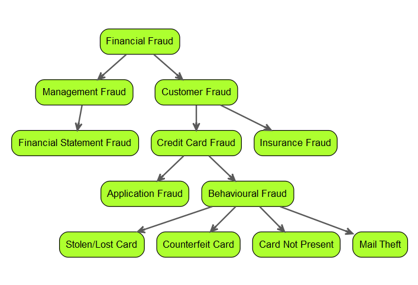{width=70%}

### E-commerce

By definition, e-commerce is the use of the Internet, the web and mobile applications to transact business [@kenneth2016commerce]. It can also be state that e-commerce represents the business transactions made in the cyberspace, or stated shortly "digitally enabled transactions" [@kenneth2016commerce]. There are five types of e-commerce - business-to-commerce (B2C), business-to-business (B2B), consumer-to-consumer (C2C), peer-to-peer (P2P) and mobile commerce (m-commerce). The most vulnerable to fraud are B2C and C2C, as the main reason is that in e-commerce the products and services can not be inspected before the transaction is done [@grabosky2001electronic]. Hence, we have increased risks of fraud. 

Transaction data is usually composed by a big number of observations and many attributes, such as amount transacted, type of transaction, recipient and etc. Hence, it is either impossible or very hard for a human analyst to appropriately find fraudulent patterns [@dal2015adaptive]. Implementation of automation systems that can scan through the e-commerce transactions is necessary for capturing fraud structures and minimizing losses [@buanuarescu2015detecting; @dal2015adaptive].

## 2.2. Costs of Financial Fraud

Financial Fraud is currently one of the biggest threats to business establishments, resulting in enormous finance losses each year. Only throughout the year 2015, the losses from credit card fraud amounted to $21.84 Billion [@nilson2016nilson]. The European Central Bank (ECB) has also reported that in 2012 for each 2 635 Euros spent on credit and debit cards issued within SEPA (the European Union, Iceland, Liechtenstein, Monaco, Norway and Switzerland), 1 Euro was lost to fraud [@ecb_fraud]. Moreover, the losses occured by firms are not only monetary - damage on reputation and customer ties could prove to be devastating [@fraudanalyticsacl]. Thus, the overall losses from financial fraud are simply incalculable [@ngai2011application]. 

The huge financial losses suffered by the business organizations shows that a method for detecting fraud is necessary. This shows the relevance of this paper, as we will discuss identifying fraudulent patterns through different machine learning techniques. 

## 2.3. Combating Financial Fraud and Related Work

As a result from the increase in the amount of data globally, there has also been a rise in the use of predictive analytics [@buanuarescu2015detecting]. When talking about financial fraud, forensic data analytics (FDA) are being used, but the percentage of sophisticated methods and software applied is unfortunately not very high (See Table 1). A big percentage of the industry uses spreadsheet tools or database tools, which in their nature are primitive in terms of data analysis. 

\begin{table}

\caption{\label{tab:table analytics}Forensic Data Analysis Tools in use}
\centering
\fontsize{8}{10}\selectfont
\begin{tabular}[t]{ll}
\toprule
Forensic.Data & Percent\\
\midrule
Spreadsheet tools such as MS Excel & 65\%\\
Database tools such as MS Access or MS SQL Server & 43\%\\
Continious monitoring tools  (SAP, Oracle, SAI Global) & 29\%\\
Text analytics tools or keyword searching & 26\%\\
Forensic analytics software (ACL, iDEA) & 26\%\\
\addlinespace
Social media/web monitoring tools & 21\%\\
Visualization and reporting tools (Tableau, Spotfire,                                                     QlikView) & 12\%\\
Statistical analysis and data-mining packages (R,                                                        SAS, Stata, SPSS) & 11\%\\
Big data technologies (Hadoop, Map Reduce) & 2\%\\
Voice searching and analysis (Nexidia, NICE) & 2\%\\
\bottomrule
\multicolumn{2}{l}{\textsuperscript{a} Source: EY (2014)}\\
\end{tabular}
\end{table}

In the report by @analytics_tools_table, the respondents state that by using more complicated and proactive methods, they have faced a 59,7% reduction in median loss, in comparison to the respondents that did not. 

Among the more complex and successful methods for fraud reduction are machine learning (ML) techniques [@chaudhary2012credit]. The ML models used for FFD, and especially credit card fraud, can be broadly categorized into two major groups - supervised and unsupervised learning methods. The unsupervised techniques depend only on the characteristics of each transaction, grouping them into clusters with homogenous attributes. Whenever an observation is not assigned to an already existing cluster of legal transactions, it signals that there is a probability that the transaction is fraudulent [@bolton2001unsupervised]. However, most studies in the field have focused on the use of supervised learning methods for FFD [@ngai2011application]. In this framework, the model is trained on already labeled datasets, recognizing the patterns associated with fraudulent transactions. Among the techniques most used for credit card are logistic regression, support vector machines (SVM), artificial neural networks (ANN), bayesian networks, and different tree models [@ngai2011application; @bhattacharyya2011data; @chaudhary2012credit].

The focus in this paper will be on supervised learning methods. In the literature, a greater focus has been put on supervised methods [@ngai2011application], but the overall financial fraud detection methods  has not been thoroughly explored, due to the sensitivity and public unavailaibility of datasets [@dal2015adaptive]. In the studies that have been done, the overall focus has been on ANNs. Among the first to adopt an ANN approach to the problem of FFD are @ghosh1994credit, through the use of a P-RCE ANN - a three layer and feed-forward network. The method employed had relative success, identifying correctly on average 40% of the fraud. The ANN is since then among the most used methods for FFD. @brause1999neural and @dorronsoro1997neural have achieved better results with an ensemble method including ANNs. However, ANNs have been, and still are, considered as black-box models and are hard to interpret. Thus, other methods, such as random forest, have risen in popularity and have also shown impressive performance in the field of FFD [@bhattacharyya2011data; @dal2014learned]. Logistic Regression is also quite popular, especially due to its strong interpretability, but can sometimes lack the prediction power of other, more complex, ML algorithms [@bhattacharyya2011data]. The SVM has also been employed, due to its advantages in terms of solid theoretical foundations. However, the results produced by the methods have been mixed, mainly because the FFD problem poses an imbalanced class challenge [@chaudhary2012credit; @bhattacharyya2011data]. Nonetheless, it has been shown that through changes in the foundations of the SVM method, in order to transform the model into a cost-sensitive one, better performance can be achieved on problems with imbalanced data [@he2009learning].

Slightly surprising is that almost no research about the performance of boosting methods has been made in the field of FFD, especially credit card fraud, given the capabilities of ML models such as stochastic gradient boosting machines and eXtreme gradient boosting [@nielsen2016tree; @chen2016xgboost]. We will deploy both methods in order to compare their performances against the other, more established, frameworks.   

# 3. Methodology

Classification is one of the most widely used model frameworks when it comes to application of machine learning techniques in terms of FFD [@ngai2011application]. It assembles and employs a model in order to give predictions for the categorical labels of unknown objects to distinguish between objects of different classes. The categorical labels are discrete, unordered and predefined [@han2011data]. Classification can also be defined as procedure of identifying a set of common features and models wich describe and distinguish data classes or concepts [@zhang2004discovering].

Some of the most common classification techniques include logistic regression, neural networks, support vector machine and decision trees and their variations.

## 3.1. Preliminaries

In the current section, we will give a description of the machine learning techniques that we apply to predict fraudulent transactions. 

Let us define our binary classification dataset as ${\{(x_1,y_1),(x_2,y_2),...,(x_N,y_N)\}}$, where $x_i\in \mathbb{R}^n$ represents an n-dimensional data point of features and $y_i \in \{-1,1\}$ represents the label of the class of that data point with $y=1$ representing a fraudulent transaction, $i = 1,...,p$. Let $X$ represent the vector of features and $Y$ the vector of dependent variable. Examples of features are amount of transaction, recipient, type of tranaction and etc.   

## 3.2. Machine Learning Algorithms

### 3.2.1. Logistic Regression

The logistic regression framework falls under the category of generalized linear models and allows the prediction of discrete outcomes. Thus, by defining the probability of a transaction being fraudulent by $p(X) = Pr(Y=1|X)$, we can portray the relationship between the dependent and independent variables as follows [@friedman2001elements]:

$$p(X) = \frac{e^{\beta_0 + \beta_1X_1 + ... + \beta_pX_p}}{1 + e^{\beta_0 + \beta_1X_1 + ... + \beta_pX_p}}\;\;\;\;(1)$$ 

The number of independent variables is indexed by *p*. After manipulating (1), we can also see that $$log(\frac{p(X)}{1-p(X)})=\beta_0+ \beta_1X_1 + ... + \beta_pX_p\;\;\;\;(2)$$ with the LHS being called the logit. Using equation (2), we will predict the probabilities of a transaction being fraudulent i.e. $p(Y = 1)$. The fitting of a logistic regression is done by the method of maximum likelihood. The logistic regression has been among the most widely used framework in fraud detection [@ngai2011application] due to simplicity of ease of implementation, but it does have its shortcomings - it tends to underperform when there are multiple or non-linear decision boundaries.

### 3.2.2. Neural Networks

Neural Networks is a term that currently describes a wide array of different algorithms. However, we will be using the "vanilla" version, which contains only one hidden layer. The model can be extended to include more layers [@friedman2001elements], but it is beyond the scope of this paper. 

A feed-forward neural network with one hidden layer can be seen in Figure 1. It has $g$ outputs nodes, which in our case would be $g=2$, as we are dealing with two-class classification problem. Each output node would give us the probability of an observation belonging to a specific class. 

{width=60%}

The features $Z_f$ are being derived through linear combinations of the inputs, while the $Y_g$ outputs are then modeled as a function of linear combinations of the $Z_m$, or mathematically formulated as follows:

$$Z_f=\sigma(\alpha_{0f}+\alpha_{m}^{T}X),\;f=1,...,F\;\;\;\;(3)$$
$$T_g=\beta_{0g}+\beta_{k}^{T}Z,\;g=1,2\;\;\;\;(4)$$
$$Y_g = f_{g}(X)=g_g(T),\;g=1,2\;\;\;\;(5)$$

where $T=(T_1,T_2)$, $Z=(Z_1,Z_2,...,Z_F)$ and $g_g(T)=\frac{e^{T_g}}{\sum_{f=1}^{F}e^{T_f}}$ represents the softmax function. The softmax function $g_g(T)$ allows us to do a final transformation on the vector of outputs T. 

We use the sigmoid activation function $\sigma(v)=\frac{1}{1+e^{-v}}$. In order to fit the neural network and estimate the set of weights $\{\alpha_{0f},\alpha_{f};f=1,2,3...,F\}$ and $\{\beta_{0g},\beta_{g},g=1,2\}$, we use the backpropagation equations in order to minimize the error term. Details on it can be seen in the Appendix section A.1.   

### 3.2.3. Support Vector Machines

Support Vector Machines, developed by @cortes1995support, have become a popular machine learning method that has seen its implementation rise in various domains that require the use of classification models [@batuwita2013class]. Among the factors for its success is the fact that the SVMs are linear classifiers, which work in a high-dimensional feature space representing a non-linear mapping of the input space of the problem being dealt with [@bhattacharyya2011data]. Working in a high-dimensional feature space has its benefits - often, the problem of non-linear classification in the original input space is transformed to a linear classification task in the high-dimensional feature space. 

The goal of the SVM classifier consists of finding the optimal separating hyperplane, which manages to effectively separate the observations from the data into two classes. As mentioned above, the observations are initially transformed by a nonlinear mapping function $\Phi$. Thus, we can write a possible separating hyperplane that resides in the transformed higher dimensional feature space [@batuwita2013class]:

$$f(x) = w\cdot\Phi(x)+b=0\;\;\;\;(6)$$
with $w$ the weight vector normal to the hyperplane. $w$ can be viewed as $\beta$ in the case of Logistic Regression (Section 3.2.1). 

We will further use two variations of the SVM soft margin optimization problem - one that assigns the same cost for missclassification of the different classes and one that penalizes more the missclassification of the minority class, in our case the fraudulent observations.

#### Non-cost sensitive learning

When dealing with a data set that is completely linearly separable, we can obtain the separating hyperplane with the maximum margin by solving the maximal margin optimization problem $\max M \;\;s.t.\;\;y_i(w \cdot \Phi(x_i) + b) \geq M$ where $M=\frac{1}{||w||}$ or more conveniently [@friedman2001elements]:

$$\min(\frac{1}{2}w\cdot w)$$
$$s.t. \;\; y_i(w \cdot \Phi(x_i) + b) \geq 1\;\;\;\;(7)$$
$$i=1,...,p$$

Nonetheless, when dealing with real-world problems, despite that they are mapped into the higher dimensional feature space we can rarely observe completeley linearly separable data sets. Hence, we introduce a slack variable $\xi$. See Figure 3 for visual depiction. 

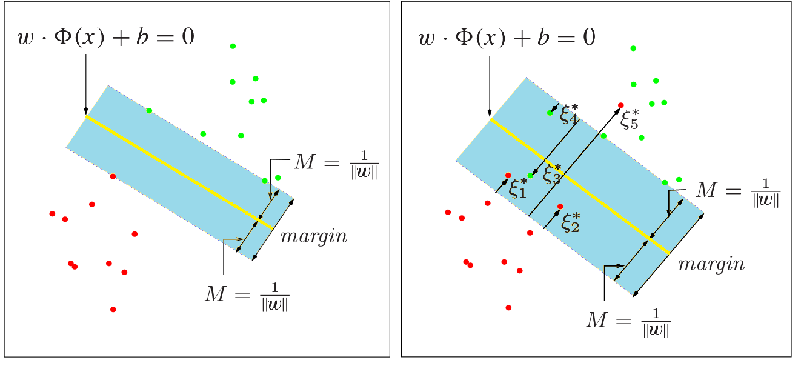{width=80%}

For the same missclassification cost case, we can write the soft optimization problem as follows:
$$\min(\frac{1}{2}w \cdot w + C\sum_{i=1}^{p} \xi_i)$$ 
$$s.t. \;\; y_i(w \cdot \Phi(x_i) + b) \geq 1 - \xi_i\;\;\;\;(8) $$
$$\xi_i \geq 0, i = 1,...,p$$
The slack variables $\xi_i > 0$ hold for missclassified examples. Thus, the penalty term $\sum_{i=1}^{p}\xi_i$ can be perceived as the total number of missclassified observations of the model. Thus from (4), we can see that there are two goals - maximizing the margin and minimizing the number of missclassifications. The cost parameter C controls the trade-off between them, i.e. assigned misclassification cost. The quadratic optimization problem in (4) can be represented by a dual Lagrange problem and then solved:
$$\max_{\alpha_i} \{ \sum_{i=1}^{p}{\alpha_i} - \frac{1}{2} \sum_{i=1}^{p}\sum_{j=1}^{p}{\alpha_i\alpha_j\Phi(x_i)\cdot\Phi(x_j)} \} \;\; s.t. \;\; \sum_{i=1}^{p}{y_i\alpha_i}=0, \;\; 0 \leq\alpha_i\leq C, \;\; i=1,...,p\;\;\;\;(9) $$

$\alpha_i$ are the Lagrange multipliers also satisfying the Karush-Kuhn-Tucker (KKT) conditions (see Appendix). Thanks to another one of the strenghts of SVM - kernel representation - we don't need to explicitly know the mapping function $\Phi(x)$, but by applying a kernel function (i.e. $K(x_i,x_j) = \Phi(x_i)\cdot \Phi(x_j)$), we can rewrite (5) as:
$$\max_{\alpha_i} \{ \sum_{i=1}^{p}{\alpha_i} - \frac{1}{2} \sum_{i=1}^{p}\sum_{j=1}^{p}{\alpha_i\alpha_jK(x_i,x_j)} \} \;\; s.t. \;\; \sum_{i=1}^{p}{y_i\alpha_i}=0, \;\; 0 \leq\alpha_i\leq C, \;\; i=1,...,p\;\;\;\;(10)$$
The solution then gives us $w = \sum_{i=1}^{p}{\alpha_iy_i}\phi(x_i)$ for the optimal values of $\alpha_i$ and $w$, while $b$ is determined from KKT. The data points that have $\alpha_i$ different than zero are called the support vectors. Thus, the decision function can be written was:
$$f(x) = sign(w \cdot \Phi(x) + b) = sign(\sum_{i=1}^{p}{\alpha_iy_i}K(x_i,x_j) + b)\;\;\;\;(11) $$

#### Cost Sensitive learning

The regular SVM model has been effectively implemented when the dataset used has balanced classes, however it fails to produce good results when applied on imbalanced data [@batuwita2013class]. When trained on a dataset with extremely imbalanced classes, the SVM framework could produce such skewed hyperplanes that all observations are recognized as the majority class [@akbani2004applying; @veropoulos1999controlling]. This is due to the fact that when we take the soft margin optimization problem, we try to maximize the margin and minimize the penalty for the misclassifications. As we consider a constant $C$ for all training examples, the minimization of the penalty is achieved through the minimization of all misclassifications. However, when the used dataset suffers from imbalanced classes, the majority class density would be higher than the minority class density, even when considering the class boundary region (through which the ideal hyperplane would pass). 

Thus, we consider here the application of the Different Error Costs (DEC) variation of the SVM algorithm proposed by @veropoulos1999controlling. The DEC method introduces different misclassification costs - $C^+$ for the minority and $C^-$ for the majority class. With the inclusion of the higher misclassification cost for the minority class observations, the imbalanced class effect could be brought down. The soft margin optimization problem then has the following form:
$$\min{(\frac{1}{2}w \cdot w + C^+\sum_{i|y_i=+1}^{p}\xi_i + C^-\sum_{i|y_i=-1}^{p}\xi_i)}$$
$$s.t. \;\; y_i(w \cdot \Phi(x_i) + b) \geq 1 - \xi_i\;\;\;\;(12)$$
$$\xi_i \geq 0, i = 1,...,p$$
The Dual Lagrange optimization form is the same as before, with the exception of replacing $0 \leq\alpha_i\leq C$ with $0 \leq\alpha_i^+\leq C^+, \; 0 \leq\alpha_i^-\leq C^-$ for $i=1,...,p$. The $\alpha_i^+$ and $\alpha_i^-$ are the Lagrange multipliers. The solution of the DEC dual Lagrangian problem follows the same outline as in the normal form. 

#### Kernels

As mentioned before, we used a kernel function ($K(x_i,x_j) = \Phi(x_i)\cdot \Phi(x_j)$) in order to transform the dual Lagrange problem. The advantages of using kernel functions are that it allows for computations that otherwise would be impossible [@james2013introduction]. For the purpose of this study, we are using the linear and radial kernels. The radial kernel shows good performance on non-linear class separation. They have the following representations:
$$Linear: \;\;\; K(x_i,x_j) = \sum_{k=1}^{l}x_{ik}x_{jk}\;\;\;\;(13)$$
$$Radial: \;\;\; K(x_i,x_j) = exp(-\gamma\sum_{k=1}^{l}(x_{ik}-x_{jk})^2), \;\; \gamma=\frac{1}{2\sigma^2}\;\;\;\;(14)$$

### 3.2.4. Tree-Based Methods

Tree-based methods involve segmentation of the feature space into a set of regions and then fitting a simple model to each one. Despite not being too complex conceptually, they are still very powerful methods [@friedman2001elements]. Firstly, we will give a short overview of a standard classification decision tree (DT) before moving on the methods used in this study. 

Let us call the set of non-overlapping regions $R_1,R_2,...,R_M$ that are used to divide the feature space. The forms of those regions are high-dimensional rectangles - for simplicity and interpretability. The aim for DT would be to find the boxes that minimize the error term, which in the case of classification can be represented in several ways - misclassification error, Gini index or cross-entropy. However, it is very computationally taxing to consider every feasible partition of the feature space into $M$ boxes. Thus, the recursive binary splitting method is used, which is a top-down, greedy approach - it starts at the top of the tree and then it splits the feature space, making the best split possible, without looking forward. 

However, the beforementioned algorithm can sometimes lead to over-fitting and producing very ineffecient prediction results. Thus, the tree pruning technique is applied - first a large tree is grown, then it is "pruned" and a smaller version is obtained. The procedure leads to reduction in variance at the cost of some bias. Usually the cost complexity pruning algorithm is used in practice. 

The regular classification DT has high interpretability, but it sometimes lacks sufficient prediction power - they are often unstable and can be too sensitive to training data [@bhattacharyya2011data]. This leads us to variations of the classic classification DT. 

#### Random Forests

A random forest algorithm is an ensemble of classification trees [@breiman2001random]. The model starts with growing each tree on separate bootstrapped dataset. Moreover, only a randomly selected feature subset, typically $s \simeq \sqrt{p}$ [@khoshgoftaar2007empirical], is used at each individual node. As a result, the entire algorithm is based on two basic, yet powerful, concepts - bagging and random subspace method. To better illustrate the random forest method, the pseudo-algorithm is given below:

_Algorithm Random Forest_

1. For $b$ = 1 to $B$ ($B$ is representing the number of bootstrapped datasets):
    + Draw bootstrapped sample $Z^*$ of size $N$ from the dataset used for training 
    + Grow a RF tree $T_b$ on the previously bootstrapped dataset by recursively looping the below given steps for each tree terminal node, up until the $n_{min}$ node (minimum size node) is reached:
        - Select $s$ features randomly from the entire feature subset, $p$. 
        - Choose the best available variable/split-point among the $s$.
        - Split node into two children nodes.

2. Output the tree ensemble $\{T_b\}^{B}_{1}$.
3. Making the prediction for a new point $x$:
    If $\widehat{C}_b(x)$ is the prediction of the class for the $b$th RF tree, then $\widehat{C}_{rf}^{B}(x)=majority\;vote\{\widehat{C}_b(x)\}_{1}^{B}$.

The Random Forest algorith has been quite popular lately, due to its simplicity and performance. It has only two parameters that can be changed - the number of trees grown and the size of the feature subset used [@breiman2001random]. Furthermore, it has often shown superior performance to one if its rival statistic learning method - the SVM [@meyer2003support]. In the area of financial fraud detection, RF has also shown to be a promising framework [@whitrow2009transaction; @ngai2011application].

#### Stochastic Gradient Boosting Machines and eXtreme Gradient Boosting Machines

The ideas introduced by the boosting methodology have been among the most influential in the last twenty years [@friedman2001elements]. Among the most used and influential boosting algorithms is "AdaBoost.M1" [@freund1997decision]. It was the first developed "adaptive" boosting algorithm, due to its incorporated function to directly adjust its parameters to the used training dataset. This is due to the fact, that the performance of the model was re-evaluated at each iteration - the parameters weights and the final aggregated weights, were re-calculated and improved at each iteration, thus leading to an overall better performance. Moreover, it was found that not only AdaBoost, but boosting algorithms in general, managed to not only reduce variance, but also bias - an improvement over bagging, where only the variance could be decreased. 

The following success led to the formulation and development of the gradient-descent based methods, which received the name gradient boosting machines or simply GBM [@freund1997decision; @friedman2000additive; @friedman2001greedy]. The general idea of GBMs is to fit new models iteratively, constructing the base-learners to be maximally correlated with the loss function's negative gradient, in order to get a better estimate of the response variable [@natekin2013gradient]. Moreover, the algorithm offers flexibility in terms of choosing the form of the loss function. In this study, we use the Bernoulli distribution, as we are dealing with a two-class classification problem. 

Due to its flexibility and ease of implementation, the GBM algorithm has proven to be a successful model, that offers high predictive power when dealing with machine learning problems [@whiting2012machine; @johnson2014learning]. Furthermore, when including a random element in the algorithm, as in the Stochastic GBM (SGBM), results tend to improve [@friedman2002stochastic]. We describe the pseudo-code of the SGBM for a two-class problem below.

_Stochastic Gradient Tree Boosting Machines (Stochastic GBM)_

Two-Class Classification as in the **gbm** R package.

1. Initialize $f_{0}(x) = \arg\min_{\rho}\sum_{i=1}^{N}\Psi(y_i,\rho)$.

2. For $m=1$ to $M$ do:
    + Compute negative gradient:
  $$z_{im}=-\frac{\partial{\Psi(y_{i},f(\mathbf{x}_i))}}{\partial{f(\mathbf{x}_i)}}\rvert_{f(\mathbf{x}_i)=\widehat{f}(\mathbf{x}_i)},\; i=1,...,N$$
    + Randomly select $s \times N$ subset.
    + Fit regression tree with K number of terminal nodes on the previously selected subset, $g(\mathbf{x})=E(z|\mathbf{x})$.
    + Compute the optimal terminal node predictions, $\rho_{1m},...,\rho_{Km}$, as:
    $$\rho_{km}=\arg\min_{\rho}\sum_{\mathbf{x}_i \in S_k} \Psi(y_i,\widehat{f}(\mathbf{x}_{i})+\rho_k),$$
    where $S_k$ is the set of $\mathbf{x}$'s that define terminal node $k$.
    + Compute $\widehat{f}_{m}(x)=\sum_{k=1}^{K}\rho_{km}I(x_i\in\widehat{R}_{km})$, as $\{\widehat{R}_{km}\}_{k=1}^{K}$ represents the tree structure.
    + Update $\widehat{f}^{m}(\mathbf{x})$ as $\widehat{f}^{m}(\mathbf{x}) \leftarrow \widehat{f}_{m-1}(\mathbf{x}) + \lambda\widehat{f}_{m}(x)$.  
      

3. Output $\widehat{f}(x) = f_{M}(x)$

The eXtreme Gradient Boosting algorithm, or shortly XGBoost, was developed as an attempt to improve on the performance of GBM, both in terms of speed and prediction power [@chen2016xgboost]. It has has not only succeeded in doing so, but it has also become one of the most used models [@nielsen2016tree]. Among the differences that XGBoost introduces in comparison to the GBM model is that the former uses clever penalization of the individual trees - the leaf weights are not all decreased at the same rate, instead the weights which are estimated without much evidence from the training set will be shrunk more heavily relative to others. Furthermore, the XGBoost employs another type of boosting structure when compared to GBM - Newton boosting. Due to this, the algorithm manages to better learn tree structures, leading to learning better neighbourhoods. XGBoost also incorporates a randomization paramater, which contributes to the individual tree decorellation and reducing variance. Some technical detail references regarding the differences between XGBoost and GBM are included in Appendix 9.1 - such as the gradient and Newton boosting and leaf weight learning. The general pseudo-codes are similar. 

## 3.3. Cross-Validation

The framework for model training that we use in this study is a $k$-fold Cross-Validation (CV) with $k=10$ [@james2013introduction]. The method incorporates a random division of the training set into $k$ folds with approximately similar size. The initial fold is used as validation set and the chosen statistical learning model is fit on the remaining $k-1$ folds. The error is then calculated on the observations in the held-out fold. The entire process is then repeated $k$ times, with a different validation set at each iteration, thus computing $k$ estimates of the test error. The $k$-fold CV estimate can then be shown as:
$$CV_{(k)}=\frac{1}{k}\sum_{i=1}^{k}Err_i$$ 
where $Err_i = I(y_i\neq \widehat{y}_i)$. 

There are other approaches to CV, such as the Leave-One-Out CV (LOOCV), but the $k$-fold CV has shown to be superior in both computational time and estimate accuracy [@friedman2001elements]. The latter is connected to the bias-variance trade-off problem, but a discussion is out of the scope of this paper. A graphical representation can be seen in Figure 1 in Appendix Section 9.4. 

## 3.4. Misclassification errors

In order to combat the problem of imbalanced classes, we also create variations of each model, discussed up until now, that fits using different missclassification errors. Only the logistic regression does not allow the use of case weights. Two different weights are assigned to the majority and minority classes, a lower and higher one respectively. This technique aids the ML techniques in paying more "attention" to the minority class, as their errors will grow faster when missclassifying a minority example, when compared to a majority one [@kriegler2010small; @chen2004using].

# 4. Data

## 4.1. Datasets

The number of datasets that we will be using in this study is three - two real-world and one synthetically generated.  

### 4.1.1. Real-World Datasets

#### UCSD-FICO Data Mining Contest 2009

The dataset was released by FICO, one of the leading analytics providers, and the University of California, San Diego (UCSD). It consists of real-world e-commerce transactions and it was released in two versions - an "easy" and a "hard" one. We will be using the "hard" version for the assessments of the models used. Due to the fact, that is a real-world data set, anonymiziation is introduced, which means that methods depending on feature aggregation or feature engineering will not lead to improvement in efficiency [@seeja2014fraudminer]. Nonetheless, some data preprocessing is done. 

The dataset consists of 100 000 transactions made by 73 729 different customers throughout 98 days. Each transaction is characterized by 20 features - amount, hour1, state1, zip1, custAttr1, field1, custAttr2, field2, hour2, flag1, total, field3, field4, indicator1, indicator2, flag2, flag3, flag4, flag5. It can be observed that custAttr1 is the customer card number, while the custAttr2 is the e-mail address. As both fields are unique, we discard custAttr2. The other unique feature pairs per customer are the amount/total, hour1/hour2 and state1/zip1, thus discarding total, hour2 and state1 leaves us with 16 fields. 

Furthermore, customers with just one transaction have been removed, leaving us with 40 918 transactions. Only 2.922% of the transactions are fraudulent, which indicates severe imbalacedness. 

#### Université Libre de Bruxelles (ULB) Machine Learning Group

The dataset was released by the Université Libre de Bruxelles (ULB) Machine Learning Group and it consists of real-world credit card transactions made throughout two days from the year 2013 [@dal2015calibrating]. Strong anonymization is introduced, as the entire dataset has gone through a Principal Component Analysis (PCA) transformation. 

The number of transactions included are 284 807 with 30 features characterizing each one. The only two labeled features are Time and Amount, while all 28 others are numericals resulting from the PCA. We do not do any feature engineering, as there is no information on what each column represents.

The number of frauds is just 492, which means only 0.172% of all transactions are positively labeled, indicating very severe class imbalance. However, we will work with 100 000 randomly selected observations, as to decrease the computation time. The fraudulent observations still represent only 0.187% of all transactions.  

### 4.1.2. Synthetically Generated Datasets

Due to lack of publicly available datasets on real-world fraud, the simulation of such has become important [@lopez2014social]. Thus, we will use one synthetically generated dataset in order to evaluate the chosen statistical learning methods and gather more data on their performance in the area of FFD. 

#### PaySim

The synthetic dataset that we will use originates from a simulator called PaySim, which was developed by @lopez2014social. It represents a simulation based on an e-commerce payment platform for making payments through a mobile device. 

The generated dataset is constructed thanks to an agent-based-simulation application, which uses real-world information. It consists of nine features - step, type, amount, nameOrig, oldbalanceOrg, newbalanceOrig, nameDest, oldbalanceDest and newbalanceDest. The step represents a time-stamp, the type shows what kind of transaction occurs, nameOrig and nameDest give us unique ID's of the sender and receiver of the transaction, while the rest oldbalanceOrg, newbalanceOrig, oldbalanceDest and newbalanceDest represent the amount present in the accounts of the sender and receiver before and after the financial transaction has been made. Furthermore, we introduce some feature engineering by creating two more variables - errorBalanceOrig and errorBalanceDest. The errorBalanceOrig is generated by summing up newbalanceOrig and amount and then subtracting oldbalanceOrg. The motivation behind this is that a positive errorBalanceOrig could be a fraud pattern, due to an amount of being lost along the line of the transaction. Analogcally, the errorBalanceDest has the some concept behind it, but for the destination account. 

Overall, the dataset consists of 6 362 620 observations, but only 0.129% of them are fraudulent, indicating very severe class imbalance. Due to the large size of the data set and the computationally-demanding methodology that we are using, only a 100 000 observation subset will be used.  

## 4.2. Problems of Imbalanced Data and Data Sampling Techniques

### 4.2.1. Problem of Imbalanced Data

One of the biggest challenges faced in detecting fraudulent transactions is the one of unbalanced class sizes, with the legitimate class outnumbering vastly the fraudulent one [@bhattacharyya2011data]. The application of data-sampling techniques has been widely used in the literature with various results when combined with different algorithms, as when such a problem occurs, it could hinder the model performances [@van2007experimental]. Data-sampling is an easier method to deal with imbalanced classes, compared to changing the inner structure of the ML technique [@van2007experimental]. Moreover, in our particular case, the cost of misclassifying the minority class could prove to be a lot more costly than predicting wrongly the majority one. 

### 4.2.2. Data Sampling Techniques

#### Random Oversampling (ROS)and Random UnderSampling (RUS)

The two techniques are the simplest and most common [@van2007experimental]. In minority oversampling (ROS), the observations from the minority group are randomly duplicated in order to balance the dataset. In majority undersampling (RUS), the aim is the same, but it is achieved by randomly removing observations of the majority class. 

#### SMOTE

Wit the Synthetic Minority Oversampling Technique (SMOTE), proposed by @chawla2002smote, artificial minority instances are created not simply through duplication, but rather with extrapolation between preexisting observations. The technique starts by taking into account the k nearest neighbourhoods to a minority observation for every instance from that class. Then, the artificial observation are created, taking into account just a part of the nearest neighbours or all of them (with respect to the desired oversampling specification).

# 5. Results

## 5.1. Performance Measures

As the problem that we deal with in this paper is a classification one, the performance measures used to evaluate how successful a model is, will be related to the main building block of binary classification - the confusion matrix.

.                    Actual.Positive       Actual.Negative     
-------------------  --------------------  --------------------
Predicted Positive   True Positive (TP)    False Positive (FP) 
Predicted Negative   False Negative (FN)   True Negative (TN)  

### 5.1.1. Threshold Metrics

$$Sensitivity = \frac{TP}{TP + FN}\;\;\;\;\;\;Specificity =\frac{TN}{FP+TN} $$
The sensitivity of a given classifier indicates what percent of the positive class has been actually predicted as positive. Analogically, specifity gives the percent of the negative class which has been assigned as negative by the model. Overall, the measures give us a picture of the proportions that have been correctly predicted.

$$Precision = \frac{TP}{TP+FP}\;\;\;\;\;\;Recall=\frac{TP}{TP+FN}$$
The precision measure indicates how well the used classifier identifies a given class' observation, i.e. checks the percent of the observations assigned a positive class that are truly positive. The recall formulation is defined analogously for the negative class. Both measures are typically used together in order to get more information about the positive class. 

### 5.1.2. Ranking Methods and Metrics

#### ROC Curve Analysis

The Receiver-Operating-Characteristic, or simply ROC, is a simple, yet very powerful tool. The ROC curve is created by using the False Posititve Rate (FPR) and Sensitivity (or True Positive Rate (TPR)) and plotting them against each at different threshold settings. The FPR is defined as $FPR=\frac{FP}{FP+TN}$. An example ROC curve can be seen in Figure 3. The better the line "hugs" the upper left corner of the ROC space, the better the trained classifier is. A model that produces a line that is close to the 45-degree separator means that it does not perform better than random guessing. 

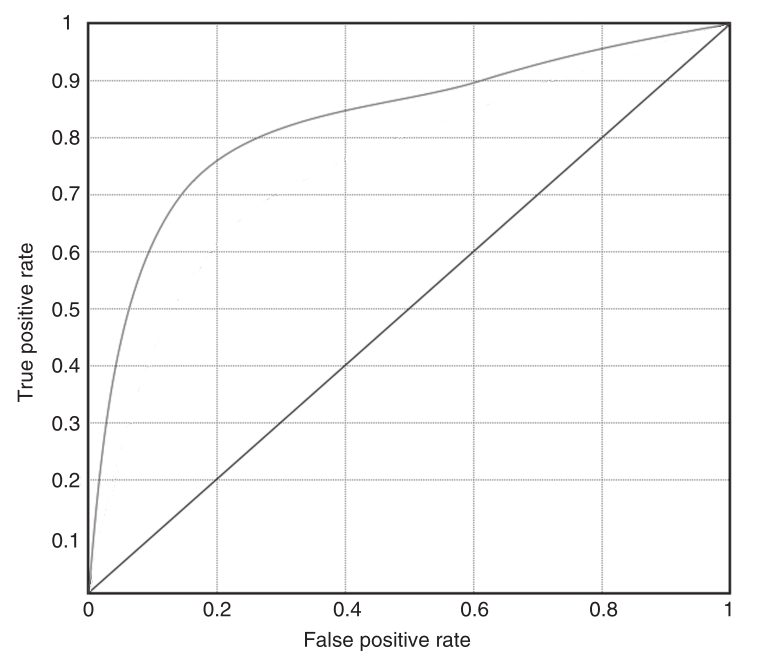{width=50%}

Moreover, when dealing with imbalanced classes, the ROC metric is a very suitable indicator of whether a model is a good fit. The first reason is that we have the performance of each class shown separately (through the two axes) and the second one is that it gives a good overview what can happen in different situations [@japkowicz2013assessment]. 

#### Precision and Recall Curve Analysis

The Precision and Recall (PR) Curve Analysis is very similar to ROC Curve Analysis, as it once again gives an overview of the correctly-classified positive class and and the number of incorrectly-classified negative observations. However, the PR curve plots, as expected, the precision and recall on the two axes, showing the various states the precision metric can take given different levels of recall. Unlike the ROC curve, the PR one has a negative slope, due to the fact precision decreases with the increase of recall. There have been suggestions that PR curves can be more informative than ROC curves when working with imbalanced classes [@davis2006relationship].

#### Area-Under-Curve (AUC)

The AUC metric illustrates the performance of a classification model averaged over all of the feasible cost ratios. Given that the ROC curve operates in a unit square, it can be seen that the AUC in this case could take values only between 0 and 1, i.e. $AUC \in [0,1]$, with $AUC=1$ representig the perfect classifier and $AUC=0.5$ the random one. It can be argued that the AUC is a good summary metric that can assess the performance of a classifier and be used for comparisons, but it too loses significant information over the entire operating range (for instance trade-off behaviour between TP and FP performances).  

## 5.2. Experimental Results

We have conducted all experiments on a machine running 4GB RAM, Intel(R) Core(TM) i3-2330M CPU @ 2.20GHz or on the Kaggle Cloud Computing Service, where depending on the statistical model that was being calculated, up to 32 cores and 17 GB RAM were utilized. The programming software that we used was R - R Studio on the local machine and R kernels on the cloud. 

We will use 10-fold Cross-Validation in order to tune the model parameters and will use the ROC as an optimization criterion, as it is argued that it is a good indicator when dealing with imbalanced classes [@he2009learning]. The Accuracy metric will be used as little as possible to determine a classifier performance, as even if a model fails to classify a single observation from the minority class, the accuraccy will still be high (and close to 100% in some cases, due to sever class imbalance). Thus the ROC and AUC metrics will be utilized in order to gauge the performances and choose the optimal machine learning technique.  

As we apply six different machine learning techniques to each dataset and we have at least five variations of each technique, we will present in detail only the comparison between different models and not between each model variation. The model variation included in the final comparison will be the one that has exhibited the best performance. For details on model tuning and variable importance, see Appendix. 

The different variations executed involve fitting the model with different data-sampling techniques , i.e. each model is fitted using the original dataset, RUS set, ROS set, SMOTE set and a weighted dataset. Each dataset has been randomly splitted to two - a train and a test subset. The train consists of 60% of the original dataset, while the test the remaining 40%. The models are fit on the train datasets.

\begin{table}

\caption{\label{tab:example_table_results}Example AUC result table}
\centering
\resizebox{\textwidth}{!}{\begin{tabular}[t]{llllllll}
\toprule
type & original & original\_radial & weighted & weighted\_radial & down & up & SMOTE\\
\midrule
Random Forest & Number in [0,1] &  & Number in [0,1] &  & Number in [0,1] & Number in [0,1] & Number in [0,1]\\
xGBoost & Number in [0,1] &  & Number in [0,1] &  & Number in [0,1] & Number in [0,1] & Number in [0,1]\\
GBM & Number in [0,1] &  & Number in [0,1] &  & Number in [0,1] & Number in [0,1] & Number in [0,1]\\
ANN & Number in [0,1] &  & Number in [0,1] &  & Number in [0,1] & Number in [0,1] & Number in [0,1]\\
Log. Regression & Number in [0,1] &  &  &  & Number in [0,1] & Number in [0,1] & Number in [0,1]\\
SVM & Number in [0,1] & Number in [0,1] & Number in [0,1] & Number in [0,1] & Number in [0,1] & Number in [0,1] & Number in [0,1]\\
\bottomrule
\end{tabular}}
\end{table}

In Figure 3, we can see an example of the tables we will use for evaluating the ROC and Precision-Recall AUC metrics. On the left, we have the six different ML techniques that are assessed and on the top are their different variations. The "down", "up" and "SMOTE" columns represent the results after applying the different data-sampling techniques. The "weighted" column, in the cases of Random Forest, xGBoost, GBM and ANN describe the results after using the technique described in *Section 3.4.*, while for the SVM it represents the cost-sensitive method as shown in *Section 3.2.3.* with a linear kernel. The "original" column shows the results with the models fit on the original data sets, without any data sampling, and in the case of SVM as the non-cost-sensitive version described in *Section 3.2.3.* with a linear kernel. The "original_radial" and "weighted_radial" columns have results only for SVM, as they show the AUC metric for the models described in *Section 3.2.3.*, but using a radial kernel.

### 5.2.1. UCSD

As mentioned in *Section 4.1.1.*, we will work with 40 918 observations. As this is a real dataset and its features are mostly masked, this means that there is no real feature engineering that we can perform before applying any machine learning techniques. 

From the 40 918 observations, only 1 196 are fraudulent. Hence, there is not much that we derive from our raw data and that can be observed from the graphics created to illustrate the distribution of the different features (See Appendix). The only interesting note that can be taken is that it seems the fraudulent class is usually associated with a transaction that has a lower amount. This can be seen in Figure 4.

{width=60%}

However, when we turn to the ML Techniques, patterns seem to arise and better predictions can be made. We first shortly present the 10-fold Cross-Validation results that were obtained from fitting the models on the dataset variations. In Tables 3 and 4, we can observe ROC AUC and Precision-Recall AUC of the models that were used in this study. 

\begin{table}

\caption{\label{tab:ucsd_models_AUC}UCSD: AUC Metric Model Variations}
\centering
\resizebox{\textwidth}{!}{\begin{tabular}[t]{lrlllrrr}
\toprule
type & original & original\_radial & weighted & weighted\_radial & down & up & SMOTE\\
\midrule
Random Forest & 0.8548012 &  & 0.854801195321834 &  & 0.8168893 & 0.8651387 & 0.8356639\\
xGBoost & 0.8218285 &  & 0.822724650168494 &  & 0.8055749 & 0.8249255 & 0.8031042\\
GBM & 0.7765399 &  & 0.773959103308491 &  & 0.7542527 & 0.7754709 & 0.7446644\\
ANN & 0.7188902 &  & 0.713344618036583 &  & 0.6970364 & 0.7083888 & 0.7015769\\
Log. Regression & 0.6902922 &  &  &  & 0.6862027 & 0.6892931 & 0.6896683\\
SVM & 0.6324302 & 0.730891032479247 & 0.641690417122343 & 0.732098151638288 & 0.6985871 & 0.6898714 & 0.7131695\\
\bottomrule
\end{tabular}}
\end{table}

\begin{table}

\caption{\label{tab:ucsd_model_PR}UCSD: PR Metric Model Variations}
\centering
\resizebox{\textwidth}{!}{\begin{tabular}[t]{lrlllrrr}
\toprule
type & original & original\_radial & weighted & weighted\_radial & down & up & SMOTE\\
\midrule
Random Forest & 0.5151509 &  & 0.515150894616222 &  & 0.3515450 & 0.4591128 & 0.4062699\\
xGBoost & 0.4242364 &  & 0.424712357392432 &  & 0.2055611 & 0.3885884 & 0.2906456\\
GBM & 0.2831942 &  & 0.177356658131735 &  & 0.1419057 & 0.1937535 & 0.1461725\\
ANN & 0.0985339 &  & 0.0860224839457332 &  & 0.0691229 & 0.0960196 & 0.0749699\\
Log. Regression & 0.0780961 &  &  &  & 0.0783426 & 0.0735142 & 0.0681947\\
SVM & 0.0574525 & 0.164502004634127 & 0.0597057939451133 & 0.164611041319705 & 0.0712216 & 0.0667245 & 0.0783384\\
\bottomrule
\end{tabular}}
\end{table}

It is quite evident from these two tables that the best performing model throughout each setting is Random Forests. Unsurprisingly, it is followed by the eXtreme Gradient Boosting, which also produces really good results. The SVM is not performing well, as expected, due to the severe class imbalance, which as mentioned in Section 3, leads to the support vector being pushed close to the majority class, thus ignoring the minority. The Logistic Regression performs relatively competitive and having a huge computational speed advantage means it is in no way irrelevant. 

In Figure 5 we also visually show the differences between the different Machine Learning Techniques. Here it is also quite evident that the Random Forest method shows superiority. Its ROC curve is higher than all the other at every point, while the Precision Recall curve is lower than the weighted xGBoost only in a very limited range. 

{width=100%}

### 5.2.2. ULB Credit Card Data

As discussed in *Section 4.1.1.*, we wil work with a subset of 100 000 bservations. Due to the fact that this a real-world dataset and has PCA performed on it in order to hide any private information, we can not perform any feature engineering or informative descriptive data analysis. 

One of the few things that we can observe by exploring our data is that the fraud class has fewer observation that are associated with very large amounts. That can be seen in Figure 6, where we show a boxplot of all transaction with amount less than 2000 in order to better illustrate the beforementioned statement. 

{width=60%}

However, when applying the ML Techniques discussed in *Section 3*, we are better able to use our data for analysing and prediction. In Tables 5 and 6, we can see the ROC AUC and Precision-Recall AUC of the different models and the different data-sampling techniques. The fitting framework is once again 10-fold Cross-Validation. 

\begin{table}

\caption{\label{tab:cr_card_models_AUC}ULB Credit Card: AUC Metric Model Variations}
\centering
\resizebox{\textwidth}{!}{\begin{tabular}[t]{lrlllrrr}
\toprule
type & original & original\_radial & weighted & weighted\_radial & down & up & SMOTE\\
\midrule
Random Forest & 0.9543801 &  & 0.954380129409309 &  & 0.9682755 & 0.9542050 & 0.9638472\\
xGBoost & 0.9692195 &  & 0.966821841051589 &  & 0.9456119 & 0.9771028 & 0.9673158\\
GBM & 0.5805464 &  & 0.974476643706951 &  & 0.9703028 & 0.9690840 & 0.9659266\\
ANN & 0.9639963 &  & 0.97376948445001 &  & 0.9708280 & 0.9554879 & 0.9567426\\
Log. Regression & 0.9443036 &  &  &  & 0.8141654 & 0.8967922 & 0.9088207\\
SVM & 0.9181649 & 0.959293341682321 & 0.92479866416197 & 0.962771863911501 & 0.9181649 & 0.9181649 & 0.9181649\\
\bottomrule
\end{tabular}}
\end{table}

\begin{table}

\caption{\label{tab:cr_card_model_PR}ULB Credit Card: PR Metric Model Variations}
\centering
\resizebox{\textwidth}{!}{\begin{tabular}[t]{lrlllrrr}
\toprule
type & original & original\_radial & weighted & weighted\_radial & down & up & SMOTE\\
\midrule
Random Forest & 0.8330339 &  & 0.833033872580155 &  & 0.7927356 & 0.8527693 & 0.8110314\\
xGBoost & 0.8336317 &  & 0.806801036974016 &  & 0.5619452 & 0.7535501 & 0.7895484\\
GBM & 0.4362846 &  & 0.820229095747952 &  & 0.4189344 & 0.8358836 & 0.5228063\\
ANN & 0.7773746 &  & 0.761886210897158 &  & 0.3955604 & 0.5590176 & 0.6677604\\
Log. Regression & 0.7584590 &  &  &  & 0.0089959 & 0.7249762 & 0.0375165\\
SVM & 0.7810338 & 0.732284403074604 & 0.771986780844536 & 0.74376414809078 & 0.7810338 & 0.7810338 & 0.7810338\\
\bottomrule
\end{tabular}}
\end{table}

From the two tables, 5 and 6,  we can observe that all models perform relatively similar. However, Random Forest and xGBoost are one step above the rest, in both the ROC AUC and Precision-Recall AUC metrics. The SVM also manages to predict better than expected, despite dealing with sever class imbalance. Nonetheless, its non-cost-sensitive variant is still the worst performing model. On this dataset we can see how the inclusion of different costs in the SVM algorithm for the different class classification manages to improve performance. Both cost-sensitive variants, using linear or radial kernel, outperform the non-cost-sensitive SVM. 

In Figure 7, both left and right, we can see the red, green and sometimes pink line, representing RF, xGBoost and GBM respectively, are slightly above all others. One common feature all these three models have in common, is that they are based on the principle of decision trees. They do employ different fitting algorithm, bagging and boosting, but still perform on a similar high level. 

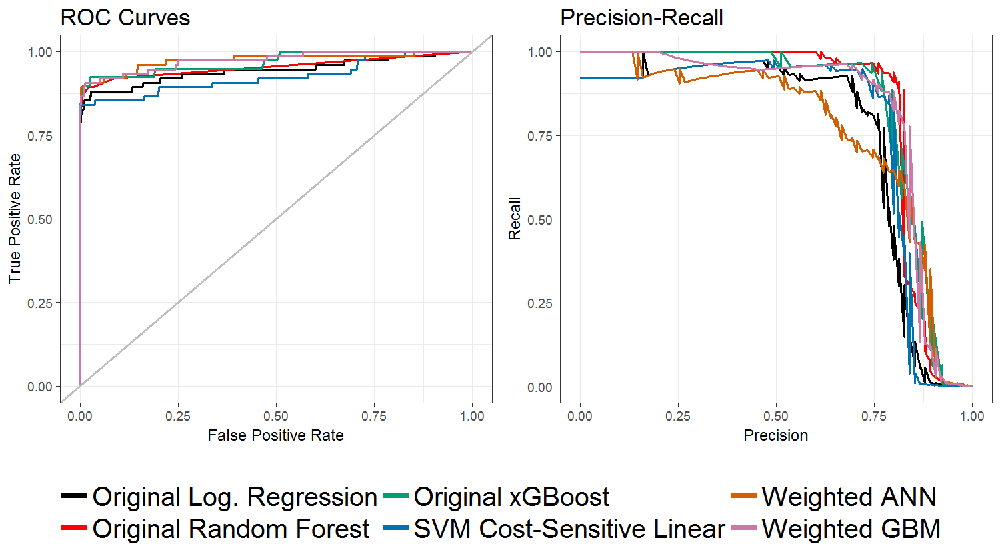{width=100%}

### 5.2.3. PaySim

As we have examined in *Section 4.1.2.*, the features contained in the PaySim are not masked and thus some descriptive data analysis can be made. Moreover, as mentioned, we have created two more features, which are based on the ones already existing in the PaySim file - errorBalanceOrig and errorBalanceDest. The errorBalanceOrig was created by summing up newbalanceOrig and amount and then subtracting oldbalanceOrg. Analogically, errorBalanceOrig is the summation of newbalanceDest and amount, then subtracting oldbalanceDest.

\begin{table}

\caption{\label{tab:paySim_fraud_types}PaySim: Transaction Types}
\centering
\fontsize{8}{10}\selectfont
\begin{tabular}[t]{lrr}
\toprule
type & isFraud & freq\\
\midrule
CASH\_IN & 0 & 21979\\
CASH\_OUT & 0 & 34914\\
CASH\_OUT & 1 & 64\\
DEBIT & 0 & 698\\
PAYMENT & 0 & 33968\\
\addlinespace
TRANSFER & 0 & 8316\\
TRANSFER & 1 & 61\\
\bottomrule
\end{tabular}
\end{table}

{width=90%}

On Table 7, it can be clearly seen that fraud occurs only on two occasions - when the transaction type is either CASH_OUT or TRANSFER. Moreover, in Figure 8, we have created some plots in which we can see how the two types of transaction, where the fraud occurs, behave. We can observe on the upper-left graphics that the fraudulent transactions mostly possess a higher amount feature than the non-fraudulent ones. Furthermore, on the lower-right plot, it can be seen how the errorBalanceOrig feature always stays at zero in the cases of fraud. From the other two graphics, we can not derive any conclusions. In Figure 9, it can also be seen that the two classes, fraud and non-fraud, are visibly separated among the three variables - amount, errorBalanceOrig and errorBalanceDest. Thus, it is expected that linear models could also perform good on this dataset. 

{width=70%}

The framework for fitting the chosen ML techniques is as before, a 10-fold Cross-Validation. It should be noted though, that for this dataset we have used a variaton of the Logistic Regression, the Bias-Reduced Logistic Regression, due to the perfect separation when working with the original model.

\begin{table}

\caption{\label{tab:paySim_models_AUC}PaySim: AUC Metric Model Variations}
\centering
\resizebox{\textwidth}{!}{\begin{tabular}[t]{lrlllrrr}
\toprule
type & original & original\_radial & weighted & weighted\_radial & down & up & SMOTE\\
\midrule
Random Forest & 0.9999954 &  & 0.99999537358316 &  & 0.9985756 & 0.9999942 & 0.9994483\\
xGBoost & 0.9999994 &  & 0.999999421697895 &  & 0.9997519 & 0.9999960 & 0.9996079\\
GBM & 0.8795264 &  & 0.99999306037474 &  & 0.9927406 & 0.9999954 & 0.9995275\\
ANN & 0.9968546 &  & 0.979752486699052 &  & 0.9797114 & 0.9713769 & 0.9902082\\
Log. Regression & 0.8717525 &  &  &  & 0.8370850 & 0.9939988 & 0.8717525\\
SVM & 0.9560930 & 0.878859588248901 & 0.955321535970391 & 0.876762086513995 & 0.8765614 & 0.9686560 & 0.9004314\\
\bottomrule
\end{tabular}}
\end{table}

\begin{table}

\caption{\label{tab:paySim_model_PR}PaySim: PR Metric Model Variations}
\centering
\resizebox{\textwidth}{!}{\begin{tabular}[t]{lrlllrrr}
\toprule
type & original & original\_radial & weighted & weighted\_radial & down & up & SMOTE\\
\midrule
Random Forest & 0.9983619 &  & 0.998361878457853 &  & 0.7850739 & 0.9980407 & 0.8255387\\
xGBoost & 0.9998013 &  & 0.999801306980356 &  & 0.9430914 & 0.9985762 & 0.9109428\\
GBM & 0.5634932 &  & 0.997471883185745 &  & 0.6816623 & 0.9983664 & 0.9108737\\
ANN & 0.9548565 &  & 0.945202667382031 &  & 0.5943965 & 0.5458254 & 0.5087932\\
Log. Regression & 0.0168379 &  &  &  & 0.0205172 & 0.6795277 & 0.0168379\\
SVM & 0.7013130 & 0.0511329411635732 & 0.702672776124839 & 0.0493418027867902 & 0.5328521 & 0.7623474 & 0.5677162\\
\bottomrule
\end{tabular}}
\end{table}

In tables 8 and 9, we can observe that all models have performed really well. Nonetheless, we can once more see how the decision tree based models, Random Forest, xGBoost and GBM are slightly ahead than all the rest. This is not very evident when looking at the ROC AUC metric, but it is more pronounced when we shift our view to the Precision-Recall AUC. It is interesting to see that despite the severe class imbalance, the SVM models has managed to produced some impressive results. Its best performance is on the dataset with RUS applied on it, meaning that the imbalance ratio was brought down by generating copies of the minoriy class observations. Nonetheless, even in its other variations, especially the cost-sensitive variant with the linear kernel, it has shown better than expected results.

Both plots on Figure 10 look quite impressive, as most lines are "hugging" the upper left or right corner for the ROC and Precision-Recall cases respectively. 

{width=100%}

## 5.3. Summary

We have thoroughly examined the performance of six ML techniques, Artificial Neural Networks, Support Vector Machines, Gradient Boosting Machines, eXtreme Gradient Boosting, Random Forest and Logistic Regression, for financial fraud detection. Two real-world datasets and one synthetically generated were used for the evaluations. Moreover, data-sampling techniques aimed at tackling the imbalanced class problem were performed. 

It is quite evident from Figures 5, 7 and 10 that obtaining good classifier performance on the real world datasets has been a harder task than doing it on the synthetically generated one. This finding is not surprising, as the PaySim is a simulation and can not perfectly generate human behaviour [@lopez2014social]. We can also observe from those three figures that the three decision tree based ML techniques, Random Forest, GBM and xGBoost, show superior performance. The good results that they produce are due to the ensemble of the decision tree model and the bagging or boosting frameworks. 

The ANN and Logistic Regression have produced conflicting results overall. In the real-world dataset cases both methods failed to impress, but when fit on the simulated data, their performance improved drastically. The reason behind this improvement is mainly that in the PaySim instance, the class separation was linear, while in the the other two it was non-linear. However, the ANN performance could certainly be improved if modifications are introduced. 

The SVM method, as expected, does not manage to produce high-quality results most of the time. However, in Tables 3, 4, 5, 6, 8 and 9 we can see that when working with the Different Error Cost SVM model, as described in *Section 3.2.3.*, the performance metrics are higher than the normal SVM without any modification or data-sampling technique. 

# 6. Further Improvements

We have given a big overview on the different ML Techniques that can be used for the problem of FFD. However, in this paper we have not delved into the details for each individual algorithm and we have explored only a part of the tunning opportunities that each of these methods offers. For instance, the ANN models can be extended to include more than just a single hidden layer or another variation of it can be tested, i.e. not the "vanilla" model. For GBM and xGBoost, a wider scope of tuning parameters can be used, which is of course associated with the need of greater computational power. Moreover, we have not developed a system that can be directly applied in a real-world scenario, where one can observe a constant data flow and detection is needed in real-time [@dal2015adaptive].

# 7. Conclusion

We currently live in times where transactions in the cyberspace are constantly rising [@fletcher2007challenges]. As discussed, loss due to fraud amounts for around 5% of the firm's yearly revenue. Globally, if applied to the 2013 GDP, the losses could be up to $3.7 trillion [@buanuarescu2015detecting]. Thus, anti-fraud mechanisms are becoming more and more important. 

This need to detect financial fraud in big data sets drives the need of applying various statistical learning methods in order to successively do so. However, due to the lack of publicly available datasets containing transactions, the research community has not had the chance to extensively test different techniques for battling fraud. With this paper, we attempt to give an overview on how different machine learning models fare when used to detect financial fraud. 

We employ the ROC, Precision-Recall and AUC metrics when evaluating the performance of the models. As discussed in *Section 5.1.*, these measures are chosen over Accuracy, as the latter is highly unsuitable when working with data sets that have imbalanced classes. Moreover, as a consequence of FFD being an imbalanced class problem, we attempt using various data-sampling techniques that have been recommended when handling such an issue [@van2007experimental; @chawla2002smote]. We include four different frameworks - random undersampling, random oversampling, SMOTE and class weighting. However, neither produced consistently better results than the models fitted on the original data. 

The experimental part has shown that the machine learning methods based on decision trees and either bagging or boosting, perform best. The former corresponds to the Random Forest methods, while the latter to the GBM and xGBoost frameworks. They have all shown superior performance when compared to the other algorithms tested in the paper - Artifical Neural Networks, SVM and Logistic Regression. The results are a consequence of the bagging and boosting algorithms' implicit characteristics of better handling non-linearity. 

However, as mentioned in *Section 6* there are many other possibilities to extend this research and improve the performances of the classifiers. Using more real-world data, which does not have its features masked, would lead to a better understanding of which techniques can actually help business organizations the most in their attempts to minimize fraud losses. Nonetheless, this paper has the potential to assist future researchers by giving them an overview of how some of the most used machine learning techniques perform when given the problem of financial fraud detection.

\clearpage
\pagenumbering{roman}
# Appendix

## A.1. Neural Networks

### Back-propagation with single hidden layer

Denote set of weights with $\theta$ and use cross-entropy error as measure of fit:

$$R(\theta)=\sum_{i=1}^{N}R_i =-\sum_{i=1}^{N}\sum_{g=1}^{G}y_{ig}\log{f_g(x_i)}$$
with a classifier $G(x)=\arg\max_{g}f_g(x)$. Compute the partial derivatives of $R_i$ w.r.t. $\beta_{qf}$ and $\alpha_{fl}$:

$$\frac{\partial R_i}{\partial \beta_{qf}}=\sum_{g=1}^{G}y_{ig}\frac{\frac{\partial}{\beta_{gqf}}[\sum_{l=1}^{G}\exp(g_l(\beta_{l}^{T}z_i)-g_g(\beta_{g}^{T}z_i))]}{\sum_{l=1}^{G}\exp(g_l(\beta_{l}^{T}z_i)-g_g(\beta_{g}^{T}z_i))}$$
$$=\frac{(\sum_{g=1,g\neq q}^{G}y_{ig}-y_{iq})\exp(g_{q}^{'}(\beta_q^Tz_i))z_fi}{\sum_{l=1}^{G}\exp(g_l(\beta_{l}^{T}z_i)-g_g(\beta_{g}^{T}z_i))}=\delta_{qi}z_{fi}$$
where $\delta_{qi}=\frac{\partial R_i}{\partial (\beta_{qf} z_{fi})}$. When considering $\alpha_{fl}$:
$$\frac{\partial R_i}{\partial \alpha_{fl}}=\sum_{g=1}^{G}\frac{\partial R_i}{\partial (\beta_{gf}z_{fi})}\frac{\partial (\beta_{gf}z_{fi})}{\partial z_{fi})}\frac{\partial z_{fi}}{\partial \alpha_{fl}}$$
$$= (\sum_{g=1}^{G}\delta_{qi}\beta_{gf})\sigma^{'}(\alpha_{f}^{T}x)=\frac{\partial R_i}{\partial (\alpha_{fl}x_{li})}$$
which is the backpropagation equation.

The gradient descent at step $r+1$ is:

$$\beta_{gf}^{(r+1)}\leftarrow\beta_{gf}^{(r)}-\gamma_r\sum_{i=1}{N}\frac{\partial R_i}{\partial \beta_{gf}^{(r)}}$$
$$\alpha_{fl}^{(r+1)}\leftarrow\alpha_{fl}^{(r)}-\gamma_r\sum_{i=1}{N}\frac{\partial R_i}{\partial \alpha_{fl}^{(r)}}$$

where $\gamma_r$ represents the learning rate. 

## A.2. SVM

### Karush-Kuhn-Tucker (KKT) conditions

$$\alpha_i(y_i(w\cdot\phi(x_i)+b)-1+\xi_i)=0,\;\;\;i=1,...,p$$
$$(C-\alpha_i)\xi_i=0,\;\;\;i=1,...,p$$

## A.3. GBM vs XGBoost

### Structure learning and the gradient vs Newton algorithms

On each iteration, the optimiziation criterias, concerning tree structure learning, of the Newton tree boosting and the Gradient tree boosting differ. 

When talking about Gradient tree boosting, we are interested in the learning of the tree, that exhibits the highest correlation with the negative gradient of the current empirical risk. The tree model is fit using:

$$\{\rho_{km}, R_{km}\}_{k=1}^{K}=\arg\min_{\{\rho_{km}, R_{km}\}_{k=1}^{K}}\sum_{i=1}^{N}\frac{1}{2}[z_{m}-\sum_{k=1}^{K}\rho_{km}I(x_{i}\in R_k)]^2$$

Newton tree boosting uses a different approach - the algorithm is learning the tree, that fits the second-order Taylor expansion of the loss function best. The tree model here is fit using:

$$\{\rho_{km}, R_{km}\}_{k=1}^{K}=\arg\min_{\{\rho_{km}, R_{km}\}_{k=1}^{K}}\sum_{i=1}^{N}\frac{1}{2}h_m[\frac{z_m}{h_m}-\sum_{k=1}^{K}\rho_{km}I(x_{i}\in R_k]^2$$

The difference is that in the case of Newton boosting, the model is fit to the negative gradient, scaled by the Hessian, using weighted least-squares regression. The Hessian is given by $h_m = \frac{\partial{\Psi(y_{i},f(\mathbf{x}_i))}^{2}}{\partial^{2}{f(\mathbf{x}_i)}}\rvert_{f(\mathbf{x}_i)=\widehat{f}(\mathbf{x}_i)}$.

### Node weight learning

The differences again come from the different boosting approaches. 

In the Newton tree boosting, the terminal node weight is being determined by the criterion that is used to determine the tree structure - terminal node weights are same as the node weights learnt when searching for the tree structure:

$$\rho_{km}=\frac{G_{km}}{H_{km}}=\frac{\sum_{x_i\in S_k}z_m(x_i)}{\sum_{x_i\in S_k}h_m(x_i)}$$

In gradient tree boosting the terminal node weights are determined by separate line searches in each terminal node:

$$\rho_{km} = \arg\min_{\rho_k}\sum_{x_i\in S_k}\Psi(y_i,\widehat{f}(\mathbf{x}_{i})+\rho_k)$$

\clearpage

## A.4 Figures

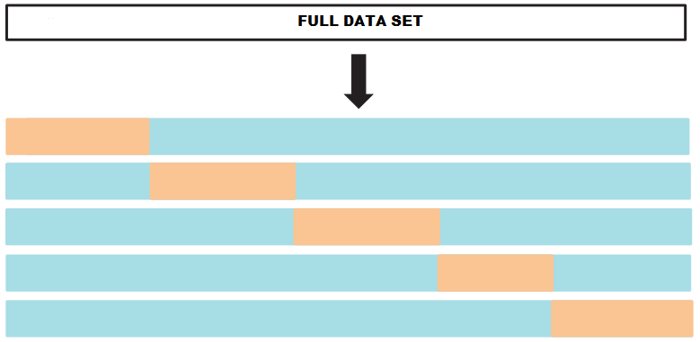{width=90%}\
**k-fold CV with k=5**

\clearpage

### A.4.1. UCSD

\center
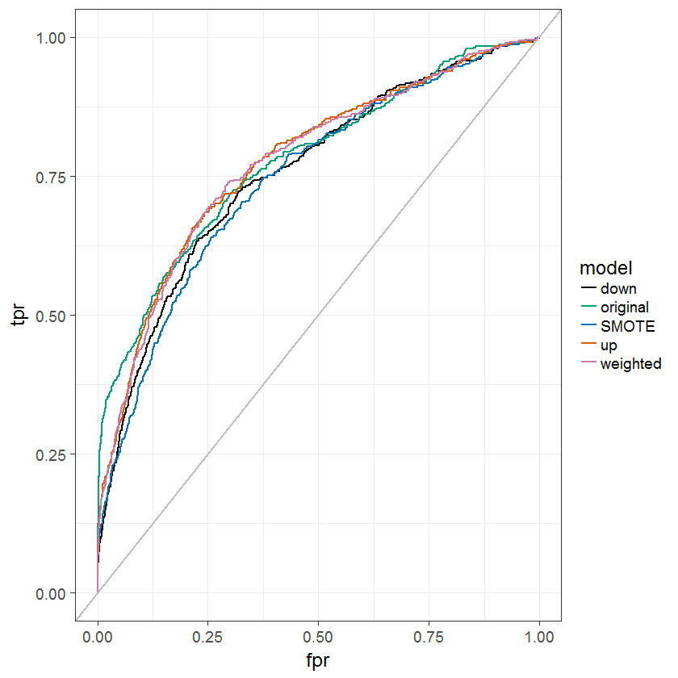{width=60%}\
**UCSD: GBM ROC Curves**

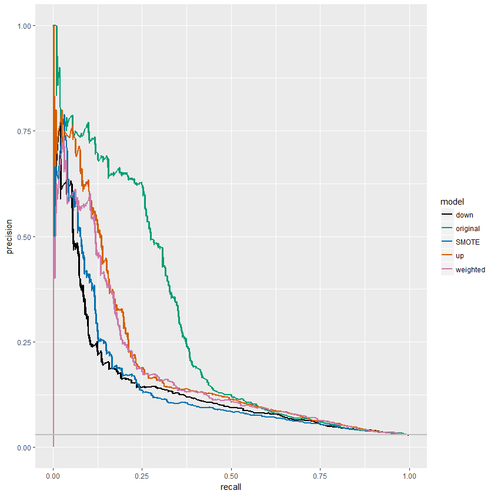{width=60%}\
**UCSD: GBM Precision-Recall Curves**

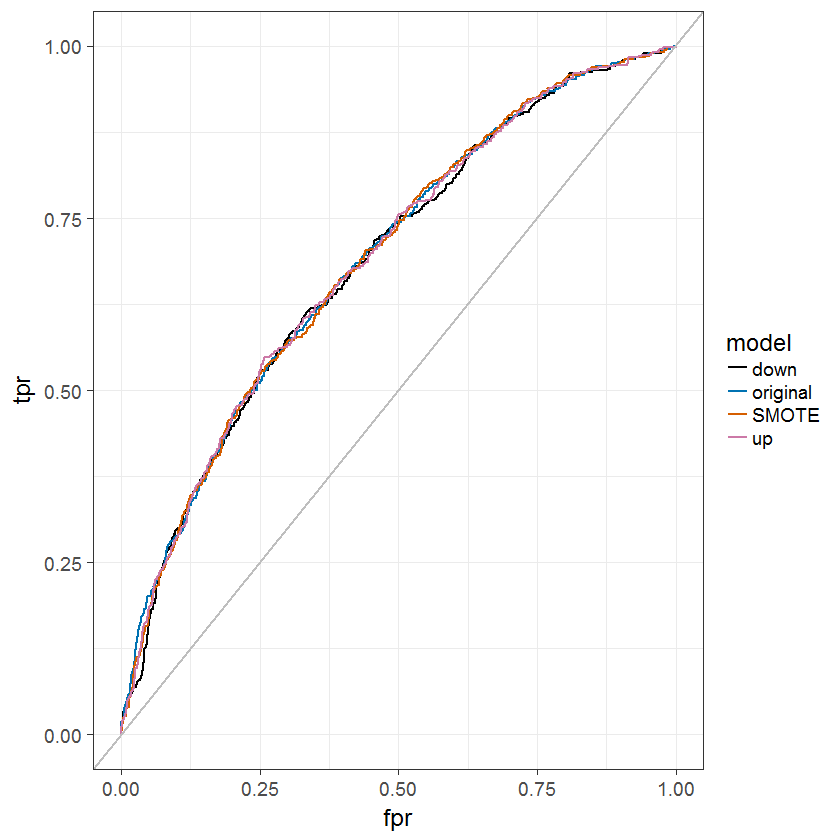{width=60%}\
**UCSD: Log. Regression ROC Curves**

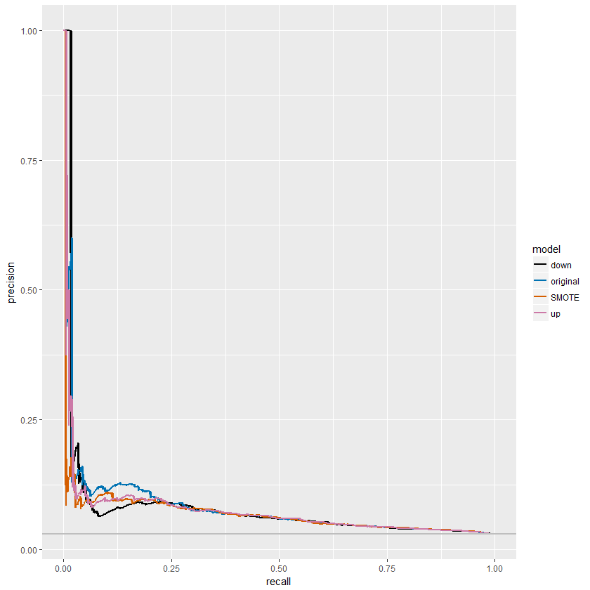{width=60%}\
**UCSD: Log. Regression Precision-Recall Curves**

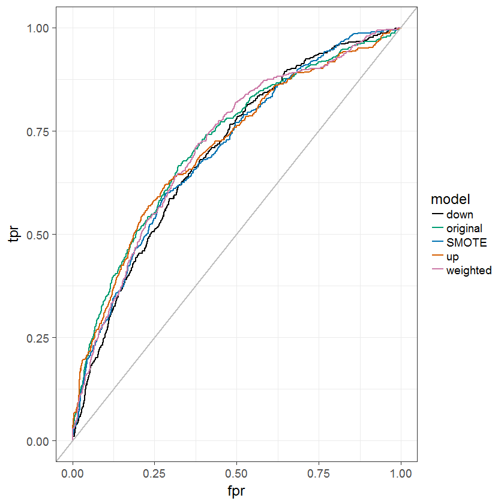{width=60%}\
**UCSD: ANN ROC Curves**

{width=60%}\
**UCSD: ANN Precision-Recall Curves**

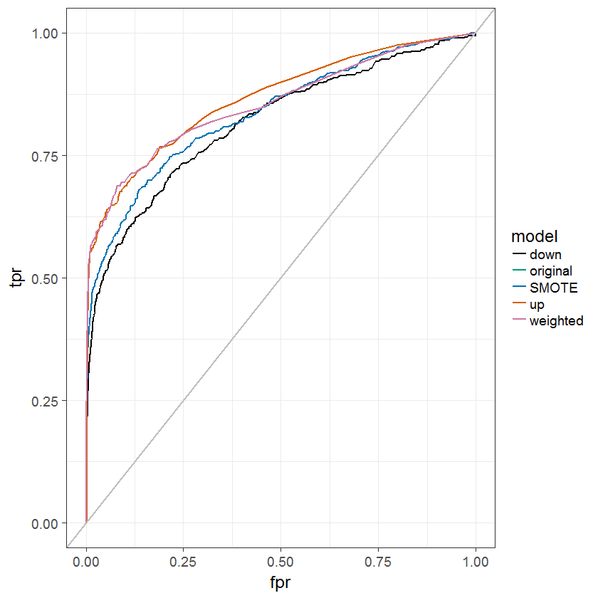{width=60%}\
**UCSD: Random Forest ROC Curves**

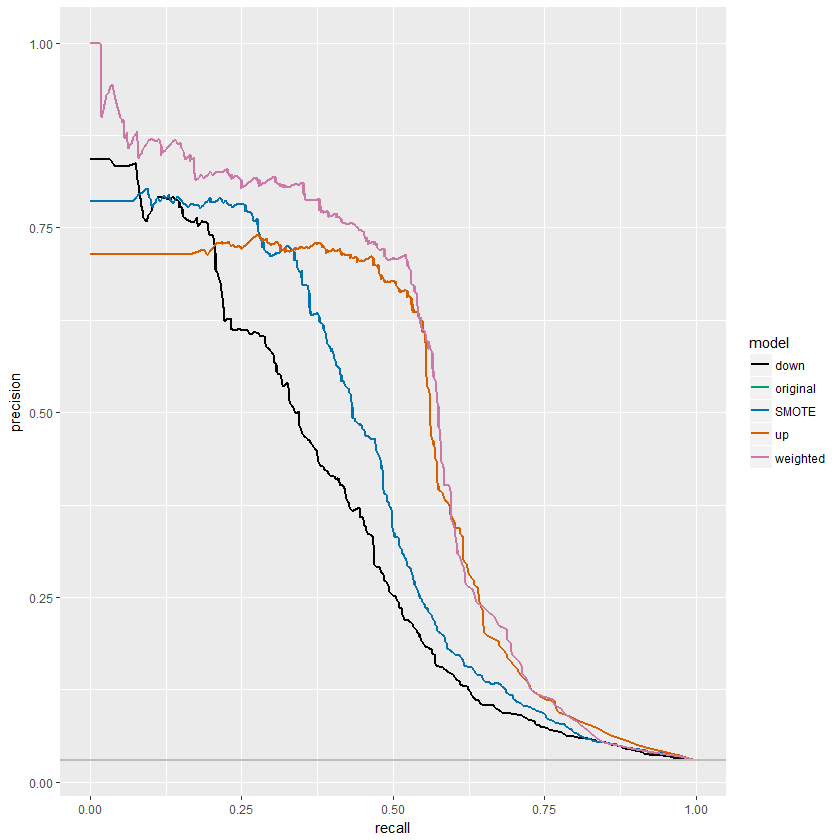{width=60%}\
**UCSD: Random Forest Precision-Recall Curves**

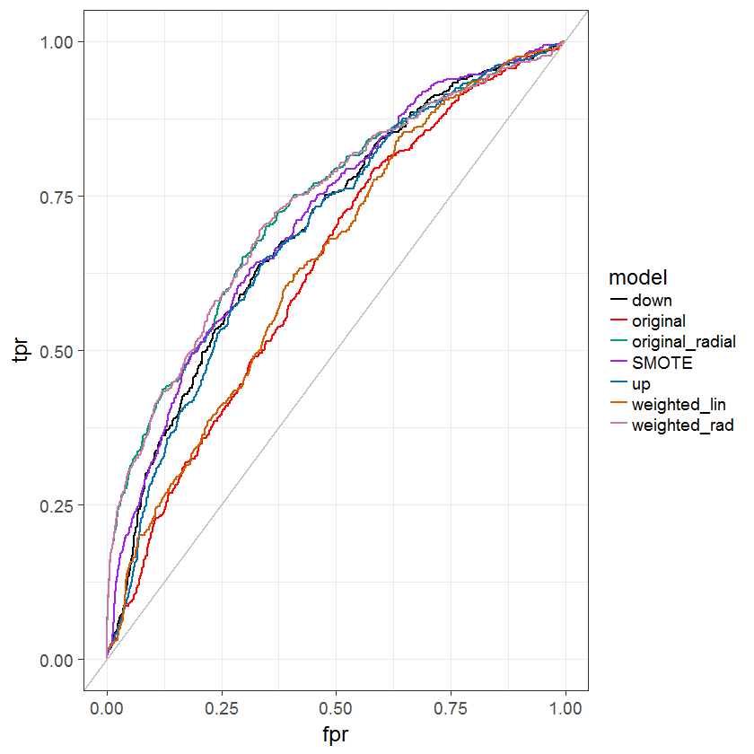{width=60%}\
**UCSD: SVM ROC Curves**

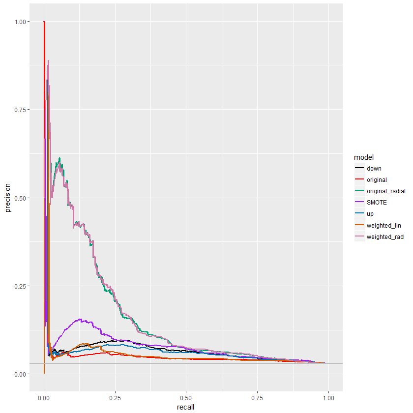{width=60%}\
**UCSD: SVM Precision-Recall Curves**

{width=60%}\
**UCSD: xGBoost ROC Curves**

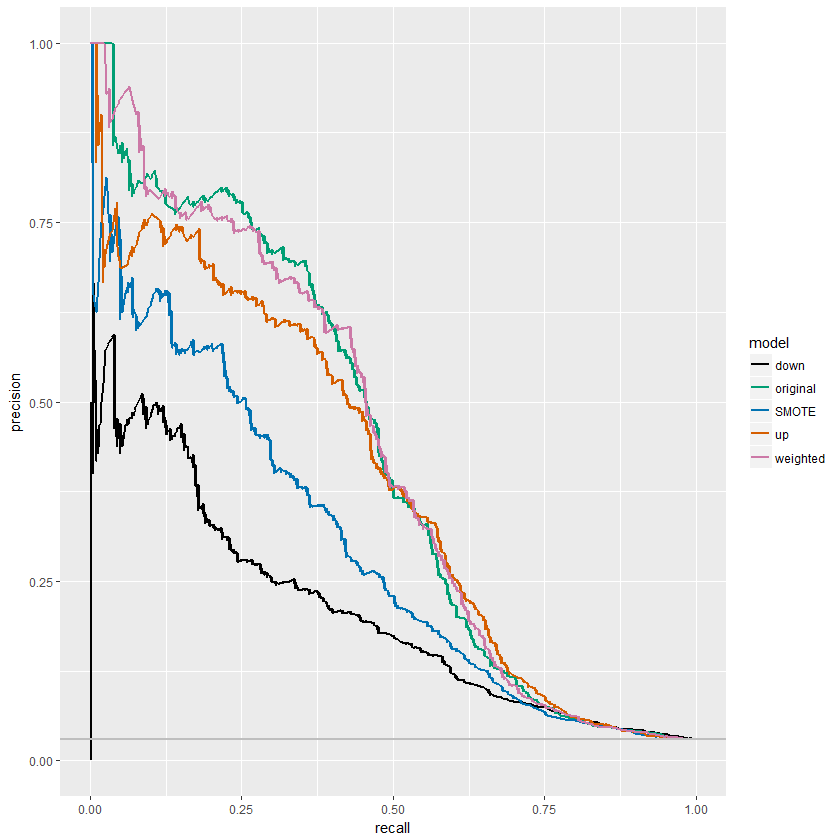{width=60%}\
**UCSD: xGBoost Precision-Recall Curves**

\justify
### A.4.2 ULB

### A.4.2. PaySim

\clearpage

\justify

# References

